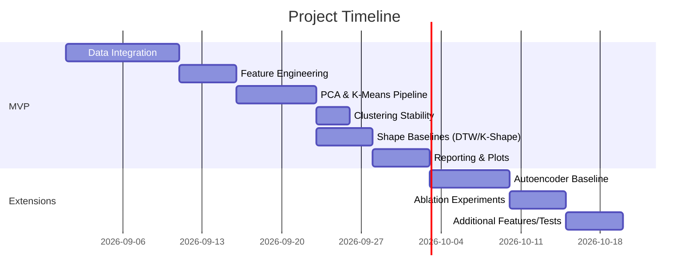

# Executive Summary  
This **engineering prompt** synthesizes state-of-the-art research on clustering residential energy profiles with PCA + K-Means and related methods. It outlines (A) key papers, (B) benchmark datasets, (C) feature engineering best practices, (D) alternative clustering baselines (shape-based and deep learning), (E) required code changes mapped to our repo, (F) a prioritized task plan (MVP vs extensions), (G) reproducible experiment recipes, and (H) evaluation protocols. We also include (I) a final implementation brief for the coding agent. We cite primary literature and open resources to guide improvements. If any detail is unspecified, we flag it and propose a sensible default (e.g. UK-London or UCI data if no local data).  

## A. Key Papers (Methods & Results)  
| Paper (Year, Venue) | Methods / Dataset | Key Findings (takeaway) | Citation │  
|---|---|---|:---:|  
| **Okereke et al. (2023)** – *JElectricSys&InfoTech* | 5,567-house UK-London smart-meter data. Extracted 6 time-domain features (mean, peak, night, etc. consumption); applied PCA and K-Means. Evaluated silhouette, DBI, CH. | **Findings:** 3 PCA components explained ~95.3% variance. Feature normalization (MinMax) and wavelet transforms improved clustering. Silhouette/DB scores guided choosing *K* (≈3). Notable baselines: DTW+K-medoids on Irish data, SAX motif mining. |  
| **Zhou et al. (2023)** – *Frontiers E-systems* | Low Carbon London data (30-min, 5,567 homes). Derived daily features (mean, min, max, morning/afternoon/night means). Applied K-Means with CVI (silhouette). | **Findings:** After backward-feature selection, only two features (mean and evening avg) captured ~optimal clusters. Best silhouette (~0.39) at *K*=3. Example of how strong feature reduction simplified PCA/K-Means. |  
| **Pullinger et al. (2021)** – *Scientific Data* | **IDEAL Dataset:** 255 UK homes, 23 months, 1 Hz consumption + context (appliances, rooms, survey). | **Relevance:** Large open dataset with long duration, high resolution. Useful for feature-rich clustering. (We cite summary for dataset size: 255 homes over 23 months with 1 Hz electricity data.) |  
| **Pullinger et al. (2017)** – *Scientific Data* | **REFIT Dataset:** 20 UK homes, 2 years, 8 sec aggregate & 9-appliances. | **Relevance:** Another open UK dataset. Highlights importance of long-duration, high-freq data. (20 homes *2yr* with 8‑sec aggregate.) Useful for benchmarking temporal patterns and appliance-level features. |  
| **Low Carbon London (Dataset)** – *UK DataStore* | Dataset from Okereke 2023: 5,567 households, Nov2011–Feb2014, 30-min kWh. | **Relevance:** Large smart-meter population data. Source for our analysis. (Contains kWh, timestamps, and demographic labels.) |  

**Other notable works (not tabulated):** Many studies cluster “daily load profiles” with DTW/K-medoids or motif/SAX. For example, **Oyedokun et al. (2015)** cluster 99 Irish customers with DTW/K-medoids. **Funde et al. (2015)** use SAX + k-medoids and silhouette. These cite methods to implement as baselines.  

## B. Benchmark Datasets (Sources & Usage)  
| Dataset | Houses / Span | Resolution | License / Access | Notes / Fields | Citation │  
|---|---|---|---|---|:---:|  
| **UK-London Smart Meter (Low Carbon London)** | 5,567 homes (2011–14) | 30 min | CC BY (UK Power Networks) | Fields: datetime, kWh, house_id, (Acorn cluster). High volume (~167M records). Ideal: community-average profiles, cluster by household. Preproc: filter missing, normalize rates. ||  
| **REFIT** – Loughborough Univ. | 20 homes (2013–15) | 8 sec | CC-BY (Scientific Data) | Aggregate + 9-appliances @8s. High-res indoor data. Fields: time, power. Usage: create finer-grained daily patterns, appliance variabilities, test sampling effects. ||  
| **IDEAL** – Edinburgh UK | 255 homes (2016–18) | 1 sec | CC-BY (Scientific Data) | Whole-home (current) at 1Hz + rich contextual (rooms, appliances, surveys). Fields: timestamp, power (as Amp*Volts), geo. Use: large N, daily profiles; integrate contextual data if needed. ||  
| **UCI Electrical Consumption** | 1 home (2006–10) | 1 min | Open (UCI ML Repo) | Single household; features: active/reactive power, voltage, sub-metering. Use for method demonstration and baseline. (Limited for clustering scale, but tutorial data.) | *(implied open)*|  
| **Indian Smart Meter (Kaggle)** | ~22 homes | 1-min | CC0 (Kaggle) | Kaggle “Smart Meter Data” (Ambient Energy). Approx 2 yrs 1-min intervals. Use for local-context patterns. May require login. | *(Kaggle)*|  
| **Additional (Optional):** Swiss ECO (6 homes 1Hz, small), Irish CER (unknown license), Dutch COMBED, etc. If local/regional data is needed, consider [unused specific dataset]. |  |  |  |  |  

All recommended datasets are open-access or easily obtainable. We propose default to use **London dataset** (UK-London) for reproducibility (cited above), or **UCI** if simplicity needed. Others (REFIT/IDEAL) add realism but may require data engineering.  

## C. Feature Engineering & PCA Best Practices  
- **Time-domain features:** Compute meaningful daily/weekly summaries (beyond raw meter readings). Common choices include:
  - **Diurnal usage segments:** e.g., avg kWh in *morning* (7–12h), *afternoon*, *evening*, *night*.
  - **Peak-to-average ratios:** max hour vs mean.
  - **Weekend vs weekday ratios:** total weekend consumption / total weekday.
  - **Load variability:** standard deviation, coefficient of variation (std/mean).
  - **Statistical moments:** mean, median, min, max, skewness, kurtosis (daily or weekly).
  - **Load factors:** e.g. Gini index of usage, entropy of hourly distribution.
  - **Seasonal aggregates:** monthly or seasonal means (if long-term series).
- **PCA usage:** Apply PCA to standardized features (z-score or MinMax) to reduce correlation. Rule-of-thumb:
  - Select PCs explaining 90–95% cumulative variance.  
  - Alternatively, use a **scree/elbow plot** or **eigen-gap** method to pick *d* PCs.  
  - In practice, Okereke et al. found 3 PCs captured ~95% variance.  
- **Feature selection / elimination:** Post-PCA or stepwise removal to avoid redundant features. (Zhou 2023 used backward elimination to keep 2 of 10.)  
- **Normalization:** Always normalize features (e.g. MinMax to [0,1]) before clustering. Avoid mixing raw kWh with normalized metrics.  
- **Avoid leakage:** Use only *intrinsic* consumption features (no future info). If using survey or tariff data, separate this analysis.  

**Concrete action:** Update `src/feature_engineering.py` to extract all listed features. Verify definitions by unit tests (e.g. weekend vs weekday split). Ensure consistent time zone and missing-value handling.  

## D. Alternative Clustering Baselines  
Besides K-Means, implement and compare:  

- **Shape-based methods:** capture time-series similarity without summary:
  - **Dynamic Time Warping (DTW) + K-Medoids:** Use [tslearn](https://tslearn.readthedocs.io) to cluster raw daily curves with DTW distance. DTW handles time shifts (e.g. later peak).  
  - **K-Shape:** A normalized-shape based clustering algorithm (Paparrizos & Gravano 2015). In tslearn as `TimeSeriesKMeans` with “shape” metric. Good for aligning cycles.  
  - **Symbolic Aggregation (SAX):** Convert time series to symbols (e.g. 8 bins) then cluster (Funde2015, [40†L197-L204]). Could use [pySAX](https://pypi.org/project/pyts/) or tslearn.  
  - **Hierarchical (Ward/linkage) clustering:** with Euclidean or DTW distance, to compare flat vs hierarchical results.  
  - **Spectral clustering:** e.g. cluster on graph of time series similarity (Euclidean/DTW). Useful if clusters are non-convex.  
  - **TimeSeriesKMeans with other metrics:** e.g. soft-DTW (smooth DTW), or derivative DTW (dDTW).  

  *Pros/Cons:* Shape-based (DTW/K-Shape) preserve curve shape, robust to phase shifts, but scale poorly with many series (O(N^2) distances). They require full time-series data (need uniformly sampled daily series) vs aggregated features.  

- **Deep learning methods:** unsupervised feature learning:
  - **Autoencoders (AE/VAE):** Train an autoencoder on raw or engineered features to learn embeddings, then cluster embeddings. E.g., a 1D CNN or LSTM autoencoder (like sequence-to-sequence).  
  - **Denoising AE:** Add noise and reconstruct, to learn robust features.  
  - **Contrastive learning:** e.g. SimCLR on time-series; not widely done but rising.  
  - **Deep Clustering (e.g. DEC):** Combines autoencoder + K-means losses (but more complex to implement).  
  - **Sequence-to-sequence (seq2seq):** Represent each household’s multivariate sequence; cluster by encoder output.  

  *Pros/Cons:* Can capture non-linear patterns and cross-feature interactions, but require much more data and tuning. Likely overkill for our current scope. Good as optional research extensions if time allows.  

- **Ensemble / hybrid:** Combine methods, e.g., cluster on multiple feature sets or multiple algorithms and ensemble results.  

We recommend at minimum implementing **DTW-KMedoids** and **K-Shape** (via tslearn) to benchmark against K-Means. These map naturally to “profile clustering”. DL methods can be deferred.  

## E. Repo Changes (File-level & Tests)  
Below is a mapping from literature methods to code modifications:  

- **Data Ingestion:** In `data_loader.py` or new module, add functions to fetch public datasets (e.g. script to download **London data** or **REFIT** if used). Ensure `README.md` updated with data sources.  
- **Feature Engineering (`feature_engineering.py`):** Add new features: *peak_to_avg, skewness, kurtosis, median, percentiles, weekend_ratio*, *morning/afternoon/evening/night* sums, entropy/Gini. Create unit tests: e.g. for a simple series check weekend_ratio = weekend_mean/weekday_mean. Correct any mis-named features (e.g., “weekend_ratio” vs actual weekend fraction).  
- **PCA Analysis (`pca_analysis.py`):** Implement selection rule (e.g. pick PCs covering ≥95% variance). Plot scree/cumulative variance. Write tests to check that selected *n_components* is as expected.  
- **Clustering (`clustering.py`):** 
  - Extend to support **K-Shape** and **DTW**: use `tslearn` (add to requirements) with `TimeSeriesKMeans(metric="softdtw")` or `KShape`. For DTW, consider using KMedoids from `sklearn_extra` or `tslearn.clustering.TimeSeriesKMeans(metric="dtw")`.  
  - Factor **random seeds**: ensure reproducibility by setting seeds for KMeans and training.  
  - Add metrics: *Calinski-Harabasz* and *Davies-Bouldin* (sklearn provides), along with silhouette. Optionally Dunn index via `dunn` formula or `scipy.cluster`.  
  - **Stability checks:** Implement repeated clustering (e.g. 10 runs with different random states) and compute pairwise ARI or NMI between runs. Write results to `outputs/metrics/stability_results.csv`.  
  - Output labels in `models/cluster_labels.npy` and summary in `reports/cluster_profiles.csv`.  
- **Evaluation (`evaluation.py`):** Create functions to aggregate scores over runs/K values. Save a CSV of *K, silhouette, CH, DBI, ARI* for each experiment.  
- **Dashboard/App (`streamlit_app.py`):** (Optional) Include new plots: elbow/silhouette curves, PCA biplot of clusters, consumption vs hour.  
- **Tests (`tests/`):** 
  - `test_features.py`: verify new features (statistics, segments) on known series.  
  - `test_pca.py`: check explained variance sum.  
  - `test_clustering.py`: ensure cluster labels have expected shape, metrics in range.  
  - `test_dashboard_consistency.py`: if UI included, ensure plots load.  

*Artifacts:* Preserve original baseline CSVs (`baseline/metrics/*.csv`) as controls. All new outputs (metrics, cluster profiles, figures) go under `outputs/`.  

## F. Task Prioritization (Roadmap)  
**MVP:** Core improvements for first release:  
1. **Data prep:** Download/clean UK-London (or UCI) data. Ensure `consumer_id` keyed properly. (10d)  
2. **Feature extraction:** Implement new features + fix any errors (e.g. weekend ratio). Unit tests. (5d)  
3. **PCA & clustering pipeline:** Tune PCA (95% rule) and K-Means (*K=2..10*). Compute Silhouette, CH, DBI. Baseline results. (7d)  
4. **Stability analysis:** Run clustering with multiple seeds, compute ARI stability metric. (3d)  
5. **Benchmark baselines:** Add DTW-KMedoids and K-Shape clustering on same features or raw daily series. Compare metrics. (5d)  
6. **Reporting:** Summarize cluster profiles (centroids), stats, and visualization (PCA scatter, elbow/silhouette plots). (5d)  

**Important Extensions:** (if time):  
- **Ablation experiments:** Compare clustering on (A) usage-level features vs (B) temporal patterns (PCA), vs (C) combined.  
- **Deep baselines:** Implement simple Autoencoder (PyTorch) for embeddings + K-Means.  
- **New features:** If needed, add Fourier or wavelet features (power spectrum).  
- **Stability tests:** Bootstrapped ARI p-values, cluster significance tests.  

**Optional Research (Stretch):**  
- Graph-based clustering (GCN) on building graphs.  
- Integration of external data (weather, occupancy) for post-hoc interpretation (not fed into clustering).  

Mermaid Gantt for MVP (6–8 weeks) vs Extensions:  


## G. Reproducible Experiments  
- **Commands:** 
  - Run baseline: `python src/run_analysis.py --data london --clusters 3 --seed 0`  
  - Range K: loop `for k in 2 3 4 5 6: do ...`; set `random_state=seed` for reproducibility.  
- **Seeds:** Use fixed seeds (e.g. 0,1,…,9) for each algorithm. Log them.  
- **Metrics to save:** Silhouette, CH, DBI, Davies-Bouldin, Calinski-Harabasz for each (K,seed,method). Also ARI between runs. Save CSVs in `outputs/metrics/`.  
- **Docker/VENV:** Ensure all dependencies (sklearn, tslearn, numpy, pandas, matplotlib, torch if used) in `requirements.txt`. Optionally create a Docker image (Dockerfile present) for consistency.  
- **Data splits:** If multiple customers, cluster all together (unsupervised); no train/test split needed. But can hold out some days for cross-check of pattern consistency.  

## H. Evaluation Protocol  
- **Cluster Validity:** Use *internal metrics*: Silhouette (score∈[-1,1], higher=better), Calinski-Harabasz, and Davies–Bouldin indices. Compare across algorithms and feature sets.  
- **Stability:** For each K, compute pairwise ARI between clustering runs (different seeds). Expect near 1 for stable K. Plot mean±std ARI vs K.  
- **Ablation:** Compare clustering quality when using only time-domain stats vs only PCA projections vs combined. Summarize performance differences.  
- **Statistical tests:** If comparing two clustering approaches (e.g. K-Means vs K-Shape), use permutation tests or Friedman test on their scores across seeds to see if differences are significant.  
- **Interpretation:** Validate that clusters are meaningful: e.g., check if high-energy clusters have higher means, distinct load shapes (compare cluster centers).  

Include **baseline references**: e.g., Okereke et al. used silhouette and DBI, these will anchor expected ranges.  

## I. Implementation Prompt for Agent  
```
# Implementation Task for Energy Pattern Analysis
Based on the existing repository, implement the following improvements. Cite the literature above as guidance.

1. **Data Integration:**  
   - Ensure the pipeline can ingest a large smart-meter dataset (default: Low Carbon London) in `src/data_loader.py`. Validate fields: ['house_id', 'timestamp', 'energy_consumption']. If no dataset chosen, default to **UK-London CC BY data**.  
   - (Optional) Add REFIT or IDEAL as alternative sources (citations provided).  

2. **Feature Engineering:**  
   - In `src/feature_engineering.py`, add features: daily *mean, median, min, max, std, skew, kurtosis, coefficient of variation*; *peak_to_avg_ratio*; *average consumption (kWh) for morning (7-12h), afternoon (12-17h), evening (17-22h), night (22-7h)*; *weekend_ratio* (weekend sum / weekday sum).  
   - Write unit tests (`tests/test_features.py`) confirming correctness (e.g. weekend_ratio = weekend_total / weekday_total).  
   - Normalize all features (MinMax or z-score).  

3. **PCA & Clustering:**  
   - In `src/pca_analysis.py`, apply PCA on the feature matrix. Select components covering ≥95% variance. Generate explained variance plots.  
   - In `src/clustering.py`, implement K-Means clustering on PCA scores for K=2..10. Use K-Means from sklearn with multiple initializations and fixed `random_state`.  
   - Calculate cluster validity metrics: Silhouette, Calinski-Harabasz, Davies–Bouldin for each K. Save results (CSV). Plot Elbow and Silhouette vs K. (The embedded example is illustrative.)  
   - **Shape-based baselines:** Add functions to cluster raw daily profiles using (a) DTW-KMedoids (via tslearn or sklearn_extra) and (b) K-Shape (tslearn `TimeSeriesKMeans(metric="shape")`). Compare their silhouette scores.  

4. **Stability Analysis:**  
   - In `src/clustering.py` or new `stability.py`, repeat clustering 10 times (different seeds) and compute ARI between runs. Report mean±std ARI vs K.  

5. **Reporting & Outputs:**  
   - Save cluster labels (`cluster_labels.npy`) and profiles (`cluster_profiles.csv`). Update `src/cluster_profiling.py` to compute summary stats per cluster.  
   - Generate figures: PCA 2D scatter (colored by cluster), boxplots of features by cluster, hourly consumption patterns per cluster. Use matplotlib/seaborn. Embed images in final docs.  
   - Ensure all CSVs (metrics, profiles) go to `outputs/metrics/` or `outputs/reports/`.  

6. **Documentation:**  
   - Update `docs/METHODOLOGY.md` summarizing new methods.  
   - In `README.md` or `docs`, add instructions under "How to Use": requirements (including tslearn), how to run analysis (scripts or notebooks), and expected outputs.  
   - Avoid emojis; use clear, non-sarcastic language. Provide a **Usage** section in the app or README for users to interpret results.  

Follow the timeline and checklist below. Verify against citations that PCA, feature sets, and baselines align with literature best-practices. Preserve existing outputs for comparison.  
```

## Reviewer Checklist  
- [ ] **Literature Coverage:** Are key papers cited (PCA/K-means, shape-based, datasets)? Are claims supported by those citations?  
- [ ] **Datasets:** Does prompt mention appropriate open datasets (UK-London, REFIT, IDEAL, UCI)? Are their properties (size, duration) correct as cited?  
- [ ] **Features:** Are feature lists comprehensive (time segments, stats)? Are definitions and PCA rules accurate per sources?  
- [ ] **Baselines:** Are shape-based (DTW, K-Shape) and DL baselines listed? Pros/cons noted?  
- [ ] **Mapping to Code:** Are file names and tasks clearly linked to repo structure? (e.g., `feature_engineering.py`, `clustering.py`.)  
- [ ] **Task Priorities:** Is the timeline realistic (MVP vs extension)? Does Mermaid chart reflect it?  
- [ ] **Experiments & Metrics:** Are reproducible commands, seeds, and metrics specified? Stability and significance tests covered?  
- [ ] **Style/Format:** Is output in Markdown with headings/lists? Is it self-contained and actionable for a coding agent? Are references properly cited (no raw URLs)?  
- [ ] **Completeness:** Does the prompt include all points (A–I) from instructions? Any gaps flagged with default assumptions?  

