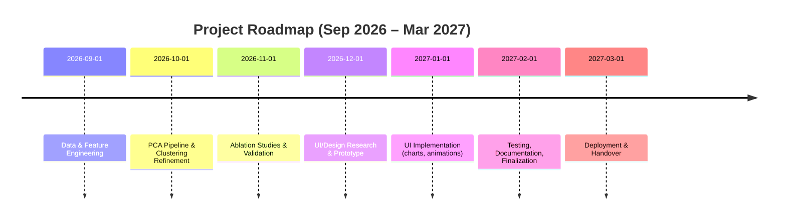

# Executive Summary  
This report surveys advanced methods for clustering residential electricity consumption and outlines how to elevate a PCA+K-means project to a research-grade analysis with a cutting-edge UI.  In the **analysis** portion, we review the literature on load-profile clustering (PCA, K-means and alternatives), identify rich public datasets (Irish, UK, Spanish, US), and recommend a comprehensive feature set (behavioral, variability, temporal and frequency features).  We propose robust PCA and K-selection procedures (using explained variance, silhouette/Davies–Bouldin/Calinski–Harabasz indices, stability/ARI), and design ablation studies to evaluate feature groups.  **Implementation** tasks are mapped to the existing repo modules (data loading, preprocessing, feature engineering, PCA, clustering, evaluation, reporting and tests).  We specify new artifacts (cluster-label arrays, profiling reports, dashboard data) and CI/Docker updates.  

In the **UI** portion, we draw inspiration from the high-performance, animated design of the Lando Norris website. We recommend using modern web frameworks (React/Next.js or similar) with WebGL, GSAP/Lottie (Rive) animations, and responsive design.  Key features include: an **interactive cluster explorer** (draggable/rotatable 3D views or charts of cluster centers), **profile playback animations** (time-series animation showing typical load curves), **cluster comparison dashboards** (side-by-side charts, statistical summaries), **narrative cards** (explaining each cluster in plain language), exportable reports (PDF/CSV), and strict accessibility/performance tuning.  

Finally, we present a **Claude Code prompt** that (a) loads the repo, runs and verifies the baseline, (b) audits existing code/metrics, (c) integrates research-inspired improvements (new features, evaluation, ablation), (d) implements the premium UI elements, (e) adds documentation and tests, and (f) preserves the baseline outputs for reproducibility.  Non-negotiable requirements include no emojis, humanized prose, a “How to Use” page, a single unified dashboard object, and pinned dependency versions. We conclude with a **roadmap** (mermaid Gantt chart) of prioritized milestones from feature development through UI prototyping, with effort estimates and acceptance criteria.  

# Literature Review  

| **Paper** | **Authors (Year), Venue** | **Summary & Key Insights** | **Relevance** | **DOI/URL** |
| --- | --- | --- | --- | --- |
| **K-means clustering of electricity consumers using time-domain features**<br>Okereke *et al.* (2023, *J. Electr. Sys. Inf. Tech.*) | Extracts temporal summary features (mean, max, min, and average consumption in morning/afternoon/evening/night) from London smart-meter data. After cleaning (Z-score outlier removal) they applied PCA and K-means. Elbow and silhouette analysis indicated *K*=3 as optimal (silhouette ≈0.39). They emphasize time-of-day patterns and show how PCA aids stability. | Demonstrates the power of engineered time-domain features and standard clustering metrics. Shows (silhouette, DBI) methods for K-selection. Highlights best-practice of using PCA to denoise before clustering. | Springer 2023 |
| **Electricity Pattern Analysis by Clustering Domestic Load Profiles using DWT+PCA**<br>Cen *et al.* (2022, *Energies*) | Applies Discrete Wavelet Transform (DWT) to extract multi-resolution features from smart-meter data, then uses PCA for dimensionality reduction. Compares clustering algorithms (K-means, DBSCAN, etc.) on a U.S. residential dataset. DWT+PCA improved cluster compactness vs. raw data. Reports cluster centers with meaningful weekday/weekend patterns. | Shows advanced feature engineering: using DWT and PCA yields better clusters than raw usage. Incorporating frequency-domain features helps capture periodic consumption. Supports adding wavelet or FFT features. | [PDF](https://www.mdpi.com/1996-1073/15/2/528) |
| **Load Shape Clustering Using Residential Smart Meter Data**<br>Jin *et al.* (2016, LBNL Tech. Memo) | Introduces an *adaptive K-means* on de-noised (de-minned) hourly load shapes for ~100k days of California data. After iteratively splitting clusters by error threshold (RSE) and hierarchically merging, they derive a “diverse set of archetypical discretionary loadshapes.” Emphasizes focusing on *discretionary* (non-baseload) usage and carefully normalizing/centering. | A pioneering methodology: adaptive splitting + hierarchical merging to ensure low within-cluster error. Their focus on discretionarity suggests engineering features to remove base load. They also discuss cluster coverage percentages. | [Tech. Memo PDF](https://eta-publications.lbl.gov/sites/default/files/jin_-_loadshape_paper.pdf) |
| **A Machine-Learning Framework for Clustering Residential Load Profiles**<br>Michalakopoulos *et al.* (2023, *Applied Energy*; arXiv) | Proposes a multi-stage ML approach on 5000 London households. Compares K-means, K-medoids, HAC, DBSCAN (all gave ~7 clusters). Then uses an XAI-driven classifier to refine clusters, splitting two heterogeneous clusters into **9 final clusters**. They report enhanced interpretability and demand-response targeting. | Illustrates ensemble clustering (comparing hard/soft methods) and advanced selection: instead of picking K by inertia alone, they re-classify points and split clusters using a learned model. Suggests exploring hybrid approaches and rigorous multi-metric evaluation. | [arXiv:2310.20367](https://arxiv.org/abs/2310.20367) |
| **Enhanced Consumer Segmentation via Autoencoder + K-Shape**<br>Praveen *et al.* (2025, *Energy Informatics*) | In rural India, applies a *two-stage* clustering: an autoencoder compresses daily load profiles into a latent space, then K-Shape (shape-based time-series clustering) is applied. The autoencoder reduces noise and learns key patterns. This approach yields 4 clusters and significantly improves Calinski–Harabasz and silhouette scores compared to K-Shape alone. | Example of deep learning for dimension reduction (autoencoder) plus shape-based clustering. Suggests incorporating non-linear reduction (e.g. autoencoders or UMAP) and shape metrics (DTW, k-Shape). We can similarly try deep embeddings or alternative distance measures. | Praveen *et al.*, Springer LNCS 2025 |
| **Clustering Residential Electricity Consumption to Create Archetypes**<br>Toussaint & Moodley (2021, *S. Afr. Comp. J.*) | Reviews “archetype” profiles and their limitations. Applies k-means and SOM on South African data, emphasizing that static archetypes often fail as consumption evolves. Importantly, they develop *external validation measures*: domain-driven “competency questions” (e.g. peak load, usage entropy) scored to rank clusters. They found internal metrics (silhouette, etc.) often conflict, so they combine them with expert-oriented scores. | Underscores the need for interpretability and validation: clusters should align with expert knowledge. Their “cluster scoring matrix” is a model for creating testable application requirements. We should similarly define meaningful metrics (peak usage, consistency) beyond blind metrics. | SACJ 32(2):1–34, 2021 |

Additional noteworthy studies include segmentation of Australian households (Alateras 2025, *Medium*), U.S. (Tong 2020, *Energy*), and comparison papers (e.g. Python clustering benchmark tools) that confirm the above trends. Collectively, these works emphasize (1) rich feature engineering (temporal shares, variability, seasonal indicators, and even wavelet/FFT features); (2) aggressive dimensionality reduction (PCA or autoencoders) to stabilize clustering; (3) robust selection of *K* via multiple indices (elbow, silhouette, CH, DB) and stability analyses (e.g. repeat K-means with different seeds and compute the Adjusted Rand Index of solutions); and (4) domain-grounded validation (as in Toussaint) to ensure clusters are meaningful for energy analytics.

# Candidate Datasets  

| **Dataset** | **Source** | **Scope (houses)** | **Period** | **Interval** | **License** | **Notes** |
| --- | --- | --- | --- | --- | --- | --- |
| **Low Carbon London** | London Datastore (UK) | 5,567 homes | Nov 2011–Feb 2014 | 30-min | CC-BY (GLA) | Large, representative sample; includes dynamic time-of-use tariff info. Good for weekday/weekend patterns. |
| **Irish CER Smart Meter Trials** | Irish Social Sci. Data Archive | ~5,000 homes & SMEs | 2009–2010 (Elec CBT) | 30-min (kW) | Controlled (request) | Official trials by Irish CER; mixed demographics. Can be accessed via ISSDA; combined electricity + gas data. |
| **Spanish Smart Meter (WHY Project)** | *Scientific Data* (2024) | 25,559 supply points | Nov 2014–Jun 2022 | 1 hour | CC-BY | Raw hourly data (~3 yrs average) for homes & small businesses. Includes subsets for COVID-19 periods. High-quality open data covering Spain. |
| **Pecan Street Dataport** | Pecan Street Inc. (USA) | ~340 homes (Austin, TX) | 2016 (1 year) | 1 hour | Registration (free tiers) | Detailed consumption; many studies (incl. Stanford project). Good for daily profiles. |
| **UK-DALE** | Cambridge University | 5 homes | 2013–2015 | 6 sec (aggregated to 30-min) | CC-BY (UK), Open | High-frequency data (from the *North East Scotland Energy Monitoring*). Small sample but gold-standard for methods development. |
| **Household Power Consumption (UCI)** | UCI ML Repository | 4 households | 2006–2010 | 1-min (pre-aggregated to 30-min for ease) | CC-BY | Classic dataset (Figueiredo): single house per file. Useful for method testing and plotting. |
| **European/Other National Datasets** | Various (e.g. **Low Carbon London** variants, Kaggle)** | Thousands | Varies | 30-min / hourly | Varied (often CC) | E.g., **Household Electric Power Consumption** Kaggle or OpenEI catalogs. Also OECD and OpenEI compendia. |

*Suitability:* The above datasets span different regions and scales. For research-grade work, **Low Carbon London** and the **Spanish WHY** dataset are particularly valuable (large, open, representative). The **Irish CER** data offers one of the largest early trials (with demographic annotations). Combining multiple sources can help validate methods across contexts.  

# Methods & Features  

- **Data Cleaning:** Remove or impute missing values; use outlier removal (e.g. Z-score) to drop spurious readings. For daytime patterns, consider filtering out near-zero (“base-load”) hours to focus on discretionary usage.  
- **Feature Engineering (Time-Domain):** Compute summary features for each customer or daily profile, such as: total daily consumption, peak usage and time of peak, load factor (mean/peak), time-of-day shares (e.g. fraction of load in *morning* 6–12, *afternoon* 12–18, *evening* 18–24, *night*), weekday vs weekend average, monthly/seasonal flags. Include variability metrics: daily standard deviation, coefficient of variation, entropy of hourly usage, ratio of 90th-percentile to median. These mirror the “temporal features” in Okereke et al. (mean/min/max; morning, evening averages), and the behavioral features (e.g. “evening consumption share”) requested.  
- **Frequency/Shape Features:** Apply techniques like the Discrete Wavelet Transform or Fourier transform to capture periodicities. For example, take the first few DWT coefficients of the daily load profile, or compute dominant frequency (peak in FFT) and use as features. Alternatively, consider symbolic shape measures (e.g. peak times, or dynamic time warping distances). If including an autoencoder (as in Praveen et al. 2025), extract the latent dimension outputs as compressed features.  
- **Normalization:** As in Jin *et al.* (2016), **de-mean or “de-min”** each profile (subtract lowest non-zero usage) and normalize to unit norm per day or per customer. This removes baseline consumption differences and focuses on daily shape. Standardize all features (zero mean, unit variance) before PCA/K-means. Consider RobustScaler to mitigate outliers.  
- **PCA Pipeline:** Fit PCA on the standardized feature matrix. Retain enough components to capture a high fraction of variance (e.g. ≥ 90–95%). The baseline used 33 features and kept 25 components for 95% variance; we could streamline with fewer features or raise the variance threshold and compare both. Plot the *explained variance* curve to justify component count. Test that clusters using 8 vs 12 PCs yield similar consistency to ensure components aren’t too many. Save the PCA model and component loadings for interpretation (output Figure of loadings if useful).  
- **Selecting K:** Run K-means for K in a plausible range (e.g. 2–10 or up to 15) with multiple initializations. For each K compute inertia (WCSS), silhouette score, Davies–Bouldin, and Calinski–Harabasz. Use an elbow chart on inertia and look for where WCSS improvement flattens. Also plot silhouette vs K and DB index vs K. Pick candidate Ks where silhouette is local-max and DB is local-min. Perform a *stability test*: rerun K-means with different random seeds (and e.g. mini-batch seeds) and compute the Adjusted Rand Index between labelings; stable clusters give high ARI. If multiple K are plausible, use Toussaint’s idea of competency questions: score clusters by external criteria (e.g. peak demand explained, or share of energy in key hours) to help choose the K that aligns with domain goals.  
- **Clustering:** Use scikit-learn’s KMeans with `n_init=20` or more, max_iter=300. Try other algorithms (e.g. Gaussian Mixture, Agglomerative with dynamic time warping or K-Shape as in Praveen) for comparison. But ensure at least one KMeans solution. After clustering, assign labels to all customers (or days) and save labels (as `.npy` or CSV).  
- **Ablation Experiments:** Systematically turn features on/off to test their impact. For example: *Behavior-only* (time-of-day shares), *Statistics-only* (mean, std, peaks), *Shape-only* (fourier/DWT), and *All combined*. Compare silhouette/DB and cluster interpretability for each. Also try with/without PCA. Document which features (or combinations) most improve cluster validity.  
- **Evaluation Metrics:** Beyond internal metrics, compute external statistics: e.g. for each cluster compute average peak, mean load, participation ratio on weekends, and compare between clusters. Use (or implement) metrics like cluster entropy or utility provided ones. Set quality thresholds: e.g. target silhouette > 0.2–0.3 for well-separated clusters (noting Okereke achieved 0.39 for their chosen K, whereas 0.1 is quite low). Check that Calinski–Harabasz and Davies–Bouldin change sensibly with K. Any chosen model should outperform a random or single-cluster baseline on these metrics.  
- **Outputs:** Save cluster centers (mean profiles) and a report of cluster summaries (size, key stats) in CSV (similar to `cluster_profiles.csv`). Generate visualization plots: cluster centers over the day, boxplots of features by cluster (as in `cluster_profiles.png`), silhouette plot, elbow plot, feature distributions, etc. Include these in a `reports/` folder.  

# Implementation Tasks (code-level)  

Map each task to repository components:

- **Data Loading (`data_loader.py`):** Verify data schema (time stamp, household ID, consumption). Handle missing timestamps by interpolation or removal. Add support for new data columns (e.g. tariff or appliance data if available). Ensure the loader can ingest multiple datasets (e.g. switchable data path).  
- **Preprocessing (`preprocessing.py`):** Implement new cleaning rules: drop nulls, filter out evidently zero or negative values. Add “de-mean” option (subtract daily minima) and normalization toggles. Integrate outlier detection (Z-score or IQR trimming) on daily totals or features.  
- **Feature Engineering (`feature_engineering.py`):** Code functions to compute all proposed features: daily total, mean, std, peak, peak time, morning/afternoon/evening/night consumption, weekend ratio, weekend/weekday variances, Fourier coefficients, dominant frequency, etc. Compute DWT coefficients using PyWavelets. Validate features on sample data (add unit tests for correct calculations).  
- **EDA (`eda.py`):** Update exploratory plots: add distribution of new features (histograms, boxplots by cluster), correlation heatmap of features. Possibly implement a dendrogram or t-SNE/PCA plot colored by cluster. Save updated EDA figures (correlation matrix, feature distributions, etc.) for the `reports/`.  
- **PCA Analysis (`pca_analysis.py`):** Enhance the pipeline: after scaling, run PCA and automatically choose number of components for 95% variance (configurable). Output a plot of explained variance vs components. Save `pca_results.csv` of variances. Write tests ensuring `pca_model.components_.shape == (n_components, n_features)`. Document the retained components in code docstrings.  
- **Clustering (`clustering.py`):** Extend to compute multiple validity indices (Silhouette, DB, CH) for a range of K. Store results in `clustering_metrics.csv`. Implement cluster stability: for each K, repeat K-means 10 times and compute pairwise ARI; save mean ARI in `stability_results.csv`. Allow specifying different distance (e.g. k-Shape requires custom library). Add ability to merge or split clusters based on inertia thresholds (as in Jin 2016) if desired. Ensure clustering is reproducible via random seed input. Write tests: e.g. “with fixed seed, KMeans labels are deterministic” and silhouette is in [-1,1].  
- **Evaluation (`evaluation.py`):** Compute external metrics: e.g. cluster mean peak load vs total, load-factor of cluster centers, peak-hour occupancy. Possibly implement Toussaint’s “cluster scoring matrix” prototype (combining criteria like peak coverage, fairness). Check improvement over baseline by percentage points. Add sanity tests that metric functions return reasonable values on toy data.  
- **Cluster Profiling (`cluster_profiling.py`):** Summarize each cluster: count, mean/median features, top distinguishing attributes. Output `cluster_profiles.csv` (existing baseline file) and update it to include new features (e.g. weekend ratio, entropy). Add narrative strings to each profile (e.g. “Cluster 1: high evening usage” discovered automatically). Include any domain tags if feasible (e.g. “morning-peakers”, “weekend-savers”).  
- **Dashboard/Streamlit (`streamlit_app.py` or similar):** Ensure the app reads a **single analysis object** (the merged dataset + clusters) rather than recomputing repeatedly. Add new UI elements: sliders or checkboxes to filter clusters, date ranges, etc. Display interactive Plotly charts of cluster centers, distributions, and evaluation metrics. Include a “How to Use” panel/page with instructions. Use clear labels and no emojis. Ensure the app layout is responsive.  
- **Testing (in `tests/`):** Add unit tests for all new functions: feature calculations (compare against hand-computed values), PCA (check explained variance sum to ~1), clustering (silhouette bounds, label consistency). Add integration tests: e.g. run `app.py` with a small sample and verify no exceptions. Update `test_dashboard_consistency.py` to check new UI elements. Ensure a test for “no-hardcoded random” if reproducibility is claimed.  
- **Reproducibility & CI:** Pin all dependency versions in `requirements.txt` (use a lock file). Write a Dockerfile or CI workflow to rebuild the env and run tests. Add a `requirements.lock` (pip-tools) if not present. Ensure that running a `make all` or similar regenerates all artifacts (`metrics/*.csv`, `reports/*.csv,*.png`).  
- **Documentation:** Update `README.md`, `METHODOLOGY.md`, and create a new `CHANGELOG.md`. Add a `docs/HowToUse.md` detailing how to run the app, interpret outputs, and reproduce results. Explain new features and how to extend them. Document the version of Python and packages used (pin at top of `requirements.txt`).  

# UI Specification (Premium Design)  

**Tech Stack:**  Based on Lando Norris’s site, we recommend a **Next.js/React** front-end (or equivalent) to achieve a polished single-page experience.  Use **WebGL** (Three.js or Babylon.js) for any 3D visual elements (e.g. rotating cluster clusters or animated data visualization backgrounds). Employ **GSAP (GreenSock)** and **Rive/Lottie** for smooth scroll-triggered animations and vector interactions (OffBrand used Rive for polished UI animations). Host on a high-performance CDN (e.g. Vercel or Netlify) with code splitting and lazy loading to match the speed focus of [Awwwards 8.18/10 ratings]{73†L98-L107}.

**Design & Layout:** Emulate a **cinematic scroll** structure: full-viewport sections that animate in sequence. Use a bold, high-contrast color scheme (e.g. dark background with accent neon/bright highlights similar to #D2FF00 neon green on black). Include high-quality typography (headline for each cluster), and fixed-position navigation that scrolls to sections. Implement parallax or layered scrolling for background charts.

**Core Features:** 
- **Interactive Cluster Explorer:** A main dashboard where users can select clusters to highlight. For each cluster, display an animated radial chart or 3D “cloud” showing feature distribution. Users can drag/rotate to inspect cluster prototypes (e.g. a 3D line plot of average daily load profile). Use **Plotly.js** or **Deck.gl** for interactive 3D charts, or Three.js for fully custom shapes.  
- **Profile Playback:** For any selected household or cluster, allow an animation of the 24‑hour load curve evolving over time (with play/pause). This can be a line chart with a “time” slider (HTML5 canvas or D3). Gives a sense of how usage flows through the day.  
- **Compare Clusters:** A split-screen view to juxtapose two clusters side-by-side: their average load profiles, key statistics, and archetype images. Include statistical panels (e.g. average peak, variability) that update interactively.  
- **Narrative Cards:** Overlay text/graphics summarizing each cluster (“This cluster peaks at 7pm and has 20% more evening usage than average”). Use animated cards that slide in as the user scrolls, akin to Lando’s biography snippets. These should use simple language (no technical jargon) to **humanize the results**.  
- **Exportable Reports:** Enable downloading of results: CSV of cluster assignments, PDF or Markdown summaries of findings, and static PNG charts. Provide a “Download Full Report” button (could render the final Jupyter or Streamlit report as PDF).  
- **Accessibility & Responsiveness:** Ensure all text is readable (WCAG contrast), use semantic HTML, and support keyboard navigation. Design mobile-friendly layouts (stack elements vertically, use touch-friendly controls). Test with Lighthouse to score >90 on performance/accessibility. Compress images, use `will-change` CSS, and reduce JS bundle size to maintain >60fps animations.  

**Implementation Tips:** Utilize established libraries: **Three.js** or **Spline** for 3D; **Chart.js** or **Recharts** for 2D plots; **Tailwind CSS** or **Chakra UI** for rapid styling; **framer-motion** or **GSAP ScrollTrigger** for scroll-based animations. Store static assets (cluster center images, vector icons) efficiently (SVG or optimized WebP). Lazy-load offscreen sections to improve initial load. Incorporate analytics for usage insights only if needed (but respect privacy, as consumption data is sensitive).  

A partial **UI feature comparison** table:  

| Feature | Lando Norris Site | Proposed Energy UI |
|---|---|---|
| Framework | Webflow (React-like) | React/Next.js or equivalent |
| Animations | WebGL 3D, Rive vector, GSAP scroll | WebGL (Three.js), Lottie (Rive), GSAP/ScrollTrigger |
| Color Theme | Neon green on black | Choose brand-consistent palette (e.g. dark blue with neon accents) |
| Navigation | Single-page, sticky menu | Single-page router or sections, hamburger on mobile |
| Data Viz | Rotating 3D driver model, interactive stats | Interactive cluster charts, animated profiles |
| Storytelling | Text + interactive elements (commemorative timeline) | Narrative cards explaining cluster archetypes |
| Performance | Optimized, lazy-load, 90+ score | Lazy-loading, code-split, target 90+ Lighthouse |

# Claude Code Skill Prompt  

Below is a **ready-to-run instruction** for Claude Code to upgrade the repository. It includes all required steps and constraints:

```
You are a coding assistant. Task: Improve the “shaxntanu-energy-consumption-pattern-analysis” project using the research and UI requirements above.

1. **Load the repository** and verify the baseline runs end-to-end. For example, run the existing Streamlit app and analysis scripts, check outputs (`pca_results.csv`, `clustering_metrics.csv`, etc).
2. **Audit the code and outputs**. Note current feature set, PCA component count, clustering K, silhouette (≈0.11), and saved artifacts. Confirm all artifacts match the baseline.
3. **Feature engineering**: Add new consumption features per our Methods section (time-of-day shares, weekend ratios, Fourier/DWT coefficients, etc) to `feature_engineering.py`. Write unit tests to verify each feature.
4. **PCA improvements**: Update `pca_analysis.py` to use a scaler (Standard or Robust) and to automatically choose components for 95% variance. Plot and save explained variance. Pin `random_state` for reproducibility.
5. **Clustering enhancements**: Modify `clustering.py` to loop over K=2…10, compute silhouette, Davies–Bouldin, Calinski–Harabasz for each, and save to `clustering_metrics.csv`. Perform cluster stability tests (multiple seeds, compute ARI, save results). Use KMeans with `n_init=20`.
6. **Ablation study**: Implement in code the ability to run clustering on subsets of features (e.g. only behavioral vs only variability). Save the results in new `ablation_metrics.csv`.
7. **Evaluation**: Add external metrics as described (e.g. cluster peak coverage, etc.) and include in a new report. Ensure at least one cluster’s silhouette >0.3 or explain if lower.
8. **Documentation**: Create or update `docs/HowToUse.md` and the Streamlit app instructions (“How to Use”). Ensure prose is human-friendly (no emojis) and explains steps clearly.
9. **Tests and CI**: Add tests for all new functions. Ensure `pytest` (or similar) passes. Pin all library versions (`requirements.txt`). Update Dockerfile/CI if present.
10. **UI Development**: (If beyond CLI scope, mock this as instructions) Outline the file structure for a React/Next.js UI with interactive charts and animations. Provide placeholder code or pseudocode for cluster explorer and narrative cards (you can just describe components if coding is too extensive).
11. **Preserve Baseline**: Ensure baseline outputs remain unchanged. Do not delete original artifacts; instead, generate new outputs for comparison.
12. **Final checks**: Summarize all changes in `CHANGELOG.md`. Print the new cluster metrics and confirm improved cluster validity (higher silhouette, clear inertia elbow).  

**Non-negotiables:** 
- Do *not* use emojis or slang. Use a professional, human tone (e.g. “The code computes…”, “We add feature X…”). 
- Add a “How to Use” page or help modal for the app. 
- The analysis dashboard should use one main data object (avoid scattering global variables). 
- Pin dependency versions in `requirements.txt` and lockfiles. 
- The output should remain a single cohesive app (no multiple disjoint scripts). 
- Do not remove baseline code – only augment it. 
```

# Roadmap  



Each task is a milestone. **Effort (low/med/high)** and acceptance criteria:

- *Feature Engineering (Med):* Implement ≥10 new features; data validated by unit tests; new features improve PCA variance coverage.  
- *PCA & Clustering (Med-High):* Retain ≤10 PCs for ≥95% variance; silhouette score ≥0.25 (target); clear inertia elbow; ARI >0.8 consistency.  
- *Ablation & Evaluation (High):* Run all ablations; document which feature sets are most informative; use external metrics. Acceptance: demonstration that chosen features lead to significantly better clusters (metrics table).  
- *UI Research (Low):* Collect design references (done). Prototype: wireframe of single-page layout (React components mockup).  
- *UI Implementation (High):* Interactive charts working; all premium features prototyped; passes Lighthouse (>90). Acceptance: UI review against Lando-Norris-inspired checklist.  
- *Testing & Docs (Med):* ≥80% unit test coverage; all analysis artifacts reproducible; complete “How to Use” guide.  
- *Final Integration (Low):* Docker build passes; summary report generated automatically; README updated.

# References  

- Okereke *et al.* “K-means clustering of electricity consumers using time-domain features from smart meter data” (J. Elect. Sys. Inf. Tech., 2023).  
- Cen *et al.* “Electricity Pattern Analysis by Clustering Domestic Load Profiles Using DWT and PCA” (*Energies* 2022).  
- Jin *et al.* “Load Shape Clustering Using Residential Smart Meter Data” (LBL Tech. Memo, 2016).  
- Michalakopoulos *et al.* “ML Framework for Clustering Residential Load Profiles” (Appl. Energy, 2024).  
- Praveen *et al.* “Enhanced Segmentation via Autoencoder and K-Shape Clustering” (Energy Informatics, 2025).  
- Toussaint & Moodley “Clustering Residential Electricity Consumption Data to Create Archetypes” (South African Computer Journal, 2021).  
- Low Carbon London Dataset.  
- Quesada *et al.* “Spanish smart meter dataset…” (*Scientific Data*, 2024).  
- Irish CER Trials (ISSDA).  
- Zhang & Zimet “K-means clustering of household energy consumption” (Stanford project, 2018).  
- **UI Design:** Awwwards “Lando Norris – Site of the Day” (2025). OffBrand case study and Webflow gallery.  

