# Project Features & Complete Pipeline

This document is the single source of truth for **every meaningful implemented
feature** in the Energy Consumption Pattern Analysis project, plus the complete
pipeline it forms. Nothing listed here is aspirational: each entry carries a
status so a reader can tell what is implemented, what has actually been run,
and what has been validated against tests or ground truth.

> **Status legend**
>
> | Status | Meaning |
> |---|---|
> | **Implemented** | The code exists in the repository. |
> | **Executed** | It has been run and produced committed artifacts. |
> | **Validated** | It is verified by tests and/or against the hidden ground truth. |
> | **Not yet executed** | It is implemented but has not been run (e.g. the optional C++ engine before it is built). |

---

## 1. The complete pipeline

### 1.1 Mermaid flowchart

```mermaid
flowchart TD
    subgraph DATA["Data"]
        A1[generate_synthetic_data<br/>200 consumers x 365 days, hourly<br/>hidden archetype + independent magnitude]
        A2[validate_dataset<br/>panel integrity: shapes, weekends, magnitude]
    end

    subgraph PREP["Preprocessing"]
        B1[preprocess_pipeline<br/>parse timestamps, sort, impute within consumer]
        B2[drop hidden truth cols<br/>archetype + seasonal_phase kept out]
    end

    subgraph FE["Feature Engineering"]
        C1[engineer_all_features<br/>24 hourly shape bins + 27 summary descriptors]
        C2[select_features<br/>behavioral / scale / combined]
        C3[StandardScaler<br/>zero mean, unit variance]
    end

    subgraph ML["Machine Learning"]
        D1[PCA<br/>covariance + Jacobi eigendecomposition<br/>keep 95% cumulative variance]
        D2[Sweep K = 2..10<br/>K-Means kmeans++ n_init=10]
        D3[Select optimal K<br/>filters + composite score + stability ARI]
    end

    subgraph EVAL["Evaluation"]
        E1[Silhouette / CH / Davies-Bouldin]
        E2[Stability across restarts ARI]
        E3[Validation vs hidden archetypes ARI/NMI]
    end

    subgraph ANALYSIS["Analysis"]
        F1[Cluster profiling<br/>real units vs population]
        F2[Recommendation engine<br/>evidence-based, no savings claims]
        F3[Explainability<br/>SHAP / permutation surrogate]
        F4[Seasonal analysis<br/>magnitude vs timing]
        F5[Longitudinal analysis<br/>segments re-fit, ARI vs full window]
    end

    subgraph ENG["Engineering"]
        G1[Streamlit simulator<br/>interactive, per-run temp dirs]
        G2[Web app Vercel<br/>Chart.js + React from committed JSON]
        G3[C++ engine energy_cpp<br/>optional pybind11 kernel]
        G4[Benchmark harness<br/>Python vs C++ on identical matrices]
    end

    A1 --> B1 --> B2 --> C1 --> C2 --> C3 --> D1
    A1 --> A2
    D1 --> D2 --> D3 --> F1 --> F2
    D3 --> E1
    D3 --> E2
    D3 --> E3
    D3 --> F3
    D1 --> F4
    F1 --> F4
    D3 --> F5
    D3 --> G1
    G3 --> G4
    G1 --> G2
    D3 --> G2

    style A1 fill:#101722,stroke:#48d7c2
    style B1 fill:#101722,stroke:#48d7c2
    style C1 fill:#101722,stroke:#48d7c2
    style D1 fill:#101722,stroke:#6c8cff
    style D3 fill:#101722,stroke:#6c8cff
    style E3 fill:#101722,stroke:#f2b04b
    style F4 fill:#101722,stroke:#b78cff
    style G3 fill:#101722,stroke:#fb7185
```

### 1.2 The pipeline in plain language

1. **Generate a synthetic panel** (`data_loader.py`). Each of 200 consumers is
   drawn from one of four hand-designed behavioural archetypes (daytime,
   evening-peaking, flat, weekend-heavy), plus an individual amplitude drawn
   *independently* of archetype. The hidden archetype label is kept in the
   DataFrame **only as an answer key for later validation** — it is dropped
   before any model sees it, and magnitude carries no archetype signal by
   construction.
2. **Validate the panel** (`validate_dataset.py`). A separate integrity pass
   checks that each consumer's mean 24-hour shape matches the archetype
   template it was drawn from, that weekend effects appear, and that magnitude
   does not leak archetype identity.
3. **Preprocess** (`preprocessing.py`). Timestamps are parsed, records sorted
   within each consumer, and gaps are imputed **only from that consumer's own
   history** (never from the population).
4. **Engineer features** (`feature_engineering.py`). Every consumer's raw
   hourly readings are turned into one row of numbers describing the **shape of
   its day** — 24 normalized hourly bins plus 27 summary descriptors. Magnitude
   is divided away before any of this, so what is measured is *when* energy is
   used, not *how much*.
5. **Select the feature group** (`select_features`). The pipeline chooses the
   behavioural group (51 features) by explicit name — never by substring
   matching, which previously pulled magnitude columns into the shape group.
6. **Standardize and reduce** (`pca_analysis.py`). Features are standardized to
   zero mean/unit variance, then PCA keeps the smallest number of components
   whose cumulative variance reaches 95%. On the flagship run that is 10
   components (cumulative 0.9505).
7. **Sweep K** (`clustering.py`). K-Means (k-means++ init, `n_init=10`,
   `random_state=42`) is fit for K = 2…10 on the PCA scores.
8. **Select K from evidence**. Candidates whose smallest cluster holds less
   than 5% of consumers, or whose mean pairwise ARI across restarts falls below
   0.60, are rejected. Silhouette, Calinski–Harabasz and Davies–Bouldin are
   min-max normalized into one composite; among candidates within tolerance the
   **smallest K wins** (simpler is preferred when ties are statistically
   indistinguishable). Flagship result: K = 4.
9. **Explain the clustering** (`explainability.py`). A small surrogate random
   forest learns the recovered labels, and SHAP (or an honest permutation
   fallback) attributes the labels in feature units. The surrogate never feeds
   back into PCA or K-Means.
10. **Profile the clusters** (`cluster_profiling.py`). Each cluster is
    described against the population in real units — peak hour, period shares,
    base-load share, weekend behaviour — and given a plain-language name.
11. **Recommendations** (`recommendation_engine.py`). The engine raises a point
    only when a cluster's characteristic deviates enough from the population.
    It makes no causal claim and quotes no savings figure.
12. **Validate against the hidden truth** (`validation.py`). Because the data
    is synthetic, the recovered clusters can be compared with the archetypes by
    permutation-invariant ARI/NMI. Flagship recovery ARI = 0.813 at K = 4.
13. **Seasonal analysis** (`seasonal_analysis.py`, 365-day horizon). Daily
    total magnitude and 24-hour shape timing are estimated separately; the
    phase is drawn independently of archetype, so seasonality does not leak
    into the grouping.
14. **Longitudinal analysis** (`longitudinal_analysis.py`, ≥ 180-day horizon).
    The window is split into segments and the whole standardize → PCA → K
    recipe is re-fit inside each; the partitions are compared with the
    full-window one by ARI. Flagship mean temporal stability ARI = 0.882.
15. **Export artifacts** (`energy_analysis.py`). Figures, CSVs, fitted models
    (`.pkl`), JSON contracts and markdown reports are written under
    `outputs/` and `models/`, and a mirror of the JSON contracts is copied to
    `web/public/data/` for the frontend.
16. **Surface the results** (engineering). The Streamlit simulator recomputes
    the pipeline live in a per-session temp directory (committed artifacts are
    never overwritten); the Vercel web app renders the committed JSON contracts
    with Chart.js/React. The **optional** C++ engine (`energy_cpp`) re-implements
    the PCA and K-Means kernels in native code and is benchmarked against the
    scikit-learn reference — it is never the scientific reference, and the
    frontend never executes it.

---

## 2. Feature registry by category

### 2.1 Data

#### Synthetic data generator — `generate_synthetic_data`
- **What is it:** A hand-designed simulator that produces a panel of hourly
  household electricity readings for `n_consumers` over `n_days`, starting on a
  given date, with an optional seasonal model.
- **What it does in this project:** Produces the only dataset the analysis
  runs on (flagship: 200 consumers × 365 days = 1,752,000 hourly records).
- **Why it is needed:** Real household data with known ground truth is not
  available; a synthetic panel with a *hidden archetype per consumer* lets the
  project validate clustering against truth that the model never sees.
- **Layman's explanation:** It plays the role of a laboratory experiment — a
  controllable world where the "correct answer" is known in advance.
- **Real-world example:** A grid operator who knows which neighbourhoods are
  residential, commercial and industrial can check whether an unsupervised
  clustering rediscovers those groups.
- **Analogy:** A training course with an answer key: students (the model) must
  find the pattern without seeing the key.
- **Input:** `n_consumers`, `n_days`, `hourly_records`, `random_seed`,
  `start_date`, `seasonal`.
- **Output:** A `pandas.DataFrame` with `consumer_id`, `timestamp`,
  `energy_consumption_kwh`, electrical context columns, `hour`,
  `day_of_week`, `is_weekend`, `month`, and the hidden `archetype` /
  `seasonal_phase` answer columns.
- **Role in pipeline:** Step 1 — the source of everything downstream.
- **Status:** Implemented · Executed · Validated (integrity pass in
  `validate_dataset.py`, seed-robustness study).

#### Dataset integrity validation — `validate_dataset`
- **What is it:** An independent audit of the generated panel.
- **What it does:** Verifies each consumer's mean shape tracks its archetype
  template, weekend effects are present, and magnitude carries no archetype
  signal.
- **Why it is needed:** To prove the synthetic data has the intended structure
  *before* the model is expected to find it.
- **Layman's explanation:** Checking the lab equipment before the experiment.
- **Real-world example:** Verifying a survey sample really contains the
  demographics it claims to.
- **Analogy:** Calibrating a scale before weighing anything.
- **Input:** The generated panel.
- **Output:** A validation report.
- **Role in pipeline:** Step 2.
- **Status:** Implemented · Executed · Validated.

#### Real-world adapter — `realworld_validate`
- **What is it:** A documented pathway to ingest an external long panel (demo:
  24 meters, 12,096 meter-hours) and run the same recipe on it.
- **What it does:** Runs the identical preprocessing → features → PCA →
  K-Means recipe on real-shaped data and reports **internal quality only**
  (silhouette, CH, DB, seed stability). It never reports ARI/NMI against
  invented labels.
- **Why it is needed:** To show the method transfers off synthetic data
  without fabricating ground-truth comparisons.
- **Status:** Implemented · Executed (CASE A demo) · Validated.

### 2.2 Preprocessing

#### Preprocess pipeline — `preprocess_pipeline`
- **What is it:** Parse, sort, and impute the panel.
- **What it does:** Parses timestamps, sorts records within each consumer,
  fills gaps (missing hours) **from that consumer's own history**, and records
  outlier statistics (drops outliers only if explicitly requested — a genuine
  consumption spike is treated as behaviour, not an error).
- **Why it is needed:** Feature engineering and PCA assume a complete,
  regular panel.
- **Layman's explanation:** Tidying each household's diary without borrowing
  from the neighbours.
- **Real-world example:** Filling a missing meter reading with that home's own
  usual value rather than the street average.
- **Analogy:** Patching a torn page in someone's journal using earlier pages
  of the same journal, not a stranger's.
- **Input:** Raw panel.
- **Output:** Cleaned panel.
- **Role in pipeline:** Step 3.
- **Status:** Implemented · Executed · Validated (tests in
  `test_preprocessing.py`).

#### Hidden-truth column separation
- **What it is:** Dropping `archetype` and `seasonal_phase` before any model
  step, while keeping the derived `season` column.
- **What it does:** Guarantees the model never sees the answer key; the key is
  re-attached only at validation.
- **Why it is needed:** Without it the ARI/NMI validation would be circular.
- **Status:** Implemented · Executed · Validated.

### 2.3 Feature Engineering (the 51 behavioural features)

All features are computed **per consumer** from the preprocessed panel, with
magnitude divided away first (each day's 24 hourly values are normalized to sum
to one), so none of them can carry how much energy a home uses.

#### 24 hourly shape bins — `hour_0_shape` … `hour_23_shape` (family of 24)
- **What it is:** The consumer's mean 24-hour load profile, normalized so the
  day sums to 1.
- **What it does:** Encodes *when* energy is used, hour by hour, as 24 numbers.
- **Why it is needed:** The daily rhythm is the core signal the clustering
  groups by.
- **Layman's explanation:** A pie chart of the day, split into 24 slices of
  "share of the day's energy."
- **Real-world example:** A home that peaks at 19:00 shows a tall evening
  slice; a 24/7 server-style consumer shows flat slices.
- **Analogy:** A footprint of the day — the same idea as a voiceprint.
- **Input:** Preprocessed panel.
- **Output:** 24 columns, one per hour, each in [0,1], summing to 1.
- **Role in pipeline:** Feature Engineering step 4.
- **Status:** Implemented · Executed · Validated.

#### Period shares — `morning_share`, `afternoon_share`, `evening_share`, `night_share`
- **What it is:** The share of daily energy in each of four six-hour blocks
  (night 0–6, morning 6–12, afternoon 12–18, evening 18–24).
- **Why it is needed:** Compresses the 24 bins into interpretable "when is the
  home busy" numbers that separate the archetypes cleanly.
- **Analogy:** Four buckets labelled morning, afternoon, evening, night.
- **Status:** Implemented · Executed · Validated.

#### `night_day_ratio`
- **What it is:** Night share divided by day share.
- **What it does:** Distinguishes night-dominated consumers (flat/always-on)
  from daytime ones.
- **Status:** Implemented · Executed.

#### Peak hour as a circle — `peak_hour_sin`, `peak_hour_cos`
- **What it is:** The hour of peak energy encoded as a point on a 24-hour
  circle (sin/cos), so 23:00 and 01:00 are close rather than 22 hours apart.
- **Why it is needed:** Raw `peak_hour` is circular; K-Means measures
  Euclidean distance and would treat midnight as far from 23:00.
- **Analogy:** Compass direction encoded as (north, east) rather than as a
  single angle that wraps.
- **Status:** Implemented · Executed.

#### `peak_concentration`
- **What it is:** How much of the day's energy sits in the peak hour relative
  to a flat day.
- **Status:** Implemented · Executed.

#### `profile_ramp`
- **What it is:** A measure of the day's overall rise/fall asymmetry.
- **Status:** Implemented · Executed.

#### `weekend_ratio`
- **What it is:** Mean weekend energy relative to mean weekday energy (from
  the raw series).
- **Why it is needed:** A weekend-heavy lifestyle is a real, learnable rhythm
  pattern.
- **Status:** Implemented · Executed · Validated.

#### `weekend_shape_distance`
- **What it is:** The distance between the consumer's normalized weekend and
  weekday shapes.
- **What it does:** Measures whether the *shape* of the day (not just the
  amount) changes on weekends.
- **Status:** Implemented · Executed.

#### Shape descriptors
- **`shape_entropy`** — Shannon entropy of the normalized shape divided by the
  entropy of a flat profile; high = evenly spread, low = concentrated.
- **`shape_gini`** — inequality of the 24 bins (Gini index); a peaked day has
  high inequality.
- **`base_load_share`** — the fraction of the day's energy that looks like a
  constant floor (the minimum-hour anchor).
- **`harmonic_1/2/3_amplitude`** — amplitudes of the first three Fourier
  harmonics of the daily shape; capture diurnal and semi-diurnal periodicities.
- **`haar_detail_l1/l2/l3`** — detail energies of a one-level Haar wavelet
  transform of the shape; capture sharp transient features the smooth
  harmonics miss.

All five descriptor families: **Implemented · Executed · Validated.**

#### Variability features
- **`peak_to_avg_ratio`** — peak hourly use divided by average hourly use;
  high for a spiky day. (The exact reciprocal `load_factor` is deliberately
  omitted — it would add no information.)
- **`coefficient_of_variation`** — hour-to-hour variation of the raw series.
- **`skewness`, `kurtosis`** — higher moments of the consumer's hourly series.

Status: **Implemented · Executed · Validated.**

#### Dispersion features
- **`daily_total_cv`** — coefficient of variation of *daily totals*, isolating
  between-day variation from within-day variation.
- **`p90_median_ratio`** — 90th percentile of hourly readings divided by the
  median; captures the upper tail.
- **`weekend_cv_ratio`** — between-day variation on weekends vs weekdays.

Status: **Implemented · Executed.**

#### Feature-group selection — `select_features`
- **What it is:** Selects a feature group by **explicit membership lists**
  (behavioral = 51, scale = 7, combined = 58), never by substring matching.
- **Why it is needed:** Substring matching previously pulled magnitude columns
  into the shape group, silently changing what the clustering measured.
- **Status:** Implemented · Executed · Validated (tests in `test_features.py`).

#### Scale features — `energy_consumption_kwh_{mean,max,min,median,std,sum}`, `current_a_mean`
- **What it is:** Magnitude descriptors used by the `scale` and `combined`
  feature groups (the ablation study).
- **What it does:** Encodes *how much* energy a consumer uses.
- **Why it is needed:** To demonstrate, in the ablation, that shape-only
  clustering recovers archetypes better than magnitude-only clustering.
- **Status:** Implemented · Executed (ablation) · Validated.

#### Context features — `voltage_v_mean`, `power_factor_mean`, `temperature_c_mean`
- **What it is:** Electrical/ambient context carried through for profiling.
- **What it does:** Not used in clustering; available for reporting.
- **Status:** Implemented · Executed.

### 2.4 Machine Learning

#### PCA — `pca_analysis.py`
- **What it is:** Principal Component Analysis on the standardized features.
- **What it does:** Fits a full PCA, then keeps the smallest number of
  components whose cumulative explained variance reaches `pca_variance_threshold`
  (0.95). Three selection rules (threshold / Kaiser / scree-elbow) are recorded;
  the threshold rule decides.
- **Why it is needed:** The 51 features are correlated by construction (period
  shares sum to one, peakiness tracks variation); PCA compresses them into
  orthogonal components so K-Means measures distance in a compact, less
  redundant space.
- **Layman's explanation:** Finding the few "directions" along which
  consumers' days differ most, and describing each consumer by those
  directions instead of 51 raw numbers.
- **Real-world example:** Summarizing a 51-question survey by the handful of
  themes that explain most of the answers.
- **Analogy:** A photographer finding the two or three angles that best
  separate a crowd of faces.
- **Input:** Standardized 200×51 matrix.
- **Output:** Scores (200×10), loadings, explained-variance curve, fitted model.
- **Role in pipeline:** Step 6.
- **Status:** Implemented · Executed · Validated (tests in `test_pca.py`; C++
  engine matches sklearn's component directions to ~1e-9 in the benchmark).

#### K-Means — `clustering.py`
- **What it is:** Lloyd's algorithm with k-means++ initialization,
  `n_init=10` restarts, `max_iter=300`, `tol=1e-4`, `random_state=42`.
- **What it does:** Partitions the PCA scores into K groups for each K in
  `k_range` (2…10).
- **Why it is needed:** The core unsupervised grouping step.
- **Layman's explanation:** Putting each consumer into the group whose
  "average day" it is closest to.
- **Analogy:** Sorting identical keys into boxes by their notches.
- **Status:** Implemented · Executed · Validated (stability, recovery,
  longitudinal; sklearn parity in tests).

#### K selection — the evidence rule
- **What it is:** A pre-registered rule applied **without** looking at the
  hidden archetypes: reject K whose smallest cluster < 5% of consumers or whose
  mean restart ARI < 0.60; min-max-normalize silhouette/CH/DB into one score;
  pick the smallest K within tolerance of the best.
- **Why it is needed:** To choose K from evidence rather than preference, and
  to prefer the simpler statistically-tied solution.
- **Status:** Implemented · Executed · Validated.

#### Optimal-K K-Means — `run_clustering_pipeline`
- **What it is:** The final K-Means fit at the selected K.
- **Status:** Implemented · Executed · Validated.

### 2.5 Evaluation

#### Internal metrics
- **Silhouette** — separation quality per point (flagship 0.328 at K=4, modest
  but real).
- **Calinski–Harabasz** — between/within variance ratio.
- **Davies–Bouldin** — worst-case cluster similarity (lower is better).

All three: **Implemented · Executed · Validated.**

#### Stability across restarts
- **What it is:** Re-fitting K-Means at each K from several seeds and computing
  the mean pairwise **Adjusted Rand Index** across partitions (labels are
  permutation-invariant).
- **Why it is needed:** K-Means depends on initialization; a finding that
  disappears across restarts is not a finding.
- **Status:** Implemented · Executed · Validated (flagship stability ARI 0.995).

#### Validation against hidden archetypes — `validation.py`
- **What it is:** Comparing the recovered clusters with the hidden archetypes
  by permutation-invariant ARI/NMI, at the selected K and across K.
- **Why it is needed:** The only ground-truth check possible — because the data
  is synthetic.
- **Status:** Implemented · Executed · Validated (flagship recovery ARI 0.813,
  NMI 0.828).

#### Seed robustness study — `run_seed_robustness`
- **What it is:** Re-running the whole generation + analysis across seeds and
  reporting how stable the numbers are.
- **Status:** Implemented · Executed.

#### Ablation study — `run_ablation_study`
- **What it is:** Running the pipeline on the `behavioral`, `scale` and
  `combined` feature groups and comparing recovery.
- **Why it is needed:** To justify the shape-only design with evidence.
- **Status:** Implemented · Executed.

### 2.6 Analysis

#### Cluster profiling — `cluster_profiling.py`
- **What it is:** A per-cluster description in real units against the
  population (peak hour, period shares, base-load share, weekend behaviour).
- **Status:** Implemented · Executed · Validated.

#### Recommendation engine — `recommendation_engine.py`
- **What it is:** Raises an evidence-based point per cluster only when a
  characteristic deviates enough from the population.
- **What it does not do:** No causal claims, no quoted savings figures.
- **Why it is needed:** To turn clusters into actionable observations without
  inventing impact.
- **Status:** Implemented · Executed.

#### Explainability — `explainability.py`
- **What it is:** A post-hoc surrogate random forest on the recovered labels,
  explained with SHAP (TreeExplainer) or an honest permutation fallback.
- **Why it is needed:** Unsupervised clustering has no native feature
  importance; the surrogate provides feature-unit explanations with its
  cross-validated accuracy as the honesty ceiling.
- **Status:** Implemented · Executed (SHAP on flagship; cv balanced accuracy
  0.985) · Validated.

#### Seasonal analysis — `seasonal_analysis.py`
- **What it is:** Separately estimated **magnitude** (annual amplitude of daily
  totals) and **timing** (phase shift of the 24-hour profile) channels.
- **Why it is needed:** To show the seasonal swing never changes a consumer's
  shape enough to move it between clusters (phase is drawn independently of
  archetype).
- **Availability:** Honest `available: false` at windows without ≥ 2 seasons.
- **Status:** Implemented · Executed (365-day flagship) · Validated.

#### Longitudinal analysis — `longitudinal_analysis.py`
- **What it is:** Splits the window into non-overlapping segments, re-fits the
  whole standardize → PCA → K recipe inside each, and compares partitions with
  the full-window one by ARI.
- **Why it is needed:** To measure whether the *structure* is stable across
  time (flagship mean temporal ARI 0.882), not whether one model repeats itself.
- **Availability:** Requires ≥ 180 days; honest `available: false` otherwise.
- **Status:** Implemented · Executed · Validated.

### 2.7 Engineering

#### Streamlit simulator — `streamlit_app.py`
- **What it is:** An interactive app that recomputes the pipeline live from
  sidebar controls.
- **What it does:** Routes each run's outputs to a **per-session temp
  directory** so committed artifacts are never overwritten; caches runs by
  config hash; renders every page from the live `AnalysisResults`.
- **Status:** Implemented · Executed · Validated (Streamlit's own test harness
  boots every page).

#### Vercel web app — `web/`
- **What it is:** A React + Chart.js landing/analysis site deployed to Vercel.
- **What it does:** Renders the committed analysis JSON contracts
  (`web/public/data/*.json`) — nothing is hand-typed into the frontend.
- **New in this upgrade:** the **Performance section** renders the committed
  benchmark report (`/data/benchmark.json`) with honest unbuilt/unexecuted
  states; the **hero** gained a theme-matched, reduced-motion-respecting
  VANTA.NET background confined to the hero copy (never behind charts or dense
  sections).
- **Status:** Implemented · Executed · Validated (`npm run build`).

#### Optional C++ engine — `cpp_engine/`
- **What it is:** A modular pybind11 module (`energy_cpp`) re-implementing the
  PCA (symmetric Jacobi eigendecomposition) and K-Means (Lloyd + k-means++)
  kernels in C++17, with OpenMP-parallel assignment and sklearn's `svd_flip`
  sign convention so components line up with the reference.
- **What it is not:** It is **not** the scientific reference — scikit-learn is.
  It is strictly optional: if it is absent or fails to build, the Python
  pipeline is untouched.
- **Status:** Implemented · execution/benchmark pending build (see Section 3).

#### Benchmark harness — `src/run_cpp_benchmark.py`
- **What it is:** A fair Python-vs-C++ comparison on identical matrices
  (best-of-3 after warmup), with ARI/AMI for K-Means labels and sign-aligned
  component differences for PCA, plus an optional end-to-end pipeline run.
- **What it never does:** It never fabricates numbers — when the C++ module is
  not built it writes an honest `not_executed` report with the build command.
- **Status:** Implemented · execution pending C++ build (see Section 3).

#### Tests — `tests/`
- **What it is:** A pytest suite covering preprocessing, feature engineering,
  PCA, clustering, profiling, dashboard consistency, dataset pages, and the
  C++ bridge (which skips cleanly when `energy_cpp` is not built).
- **Status:** Implemented · Executed (see Section 3).

### 2.8 Applications

#### Interactive simulator for practitioners
- **What it is:** The Streamlit app as a hands-on tool to explore horizons,
  feature sets, seeds and their effect on the whole analysis.
- **Status:** Implemented · Executed · Validated.

#### Web storytelling site
- **What it is:** The Vercel site that explains the method, shows the charts,
  lists the references, and links the simulator.
- **Status:** Implemented · Executed · Validated (`npm run build`).

#### Performance engineering showcase
- **What it is:** The C++ engine + benchmark as a demonstration that the two
  compute kernels can run in native code while staying numerically consistent
  with the scikit-learn reference.
- **Status:** Implemented; build + benchmark pending toolchain (Section 3).

---

## 3. Execution status of the C++ engine & benchmark

| Item | Status | Notes |
|---|---|---|
| `cpp_engine/` source (headers, `.cpp`, bindings, CMake, setup.py) | **Implemented** | Authored; awaits build. |
| `src/cpp_bridge.py` bridge | **Implemented** | `AVAILABLE`/`resolve_engine`/wrappers/kernel patch. |
| `src/run_cpp_benchmark.py` harness | **Implemented** | Writes honest states when module missing. |
| Build (`py -m pip install ./cpp_engine` or CMake) | **Not yet executed** | Requires a C++ toolchain. |
| Benchmark run (`py src/run_cpp_benchmark.py`) | **Not yet executed** | Writes `outputs/benchmarks/*` + web mirror. |
| Bridge tests (`tests/test_cpp_bridge.py`) | **Implemented** | Skip cleanly when module absent. |

*This table is updated to reflect the actual build/run once the toolchain is
available; the benchmark report itself (`outputs/benchmarks/benchmark_results.json`)
is the authoritative record and always states `executed` or `not_executed`.*
