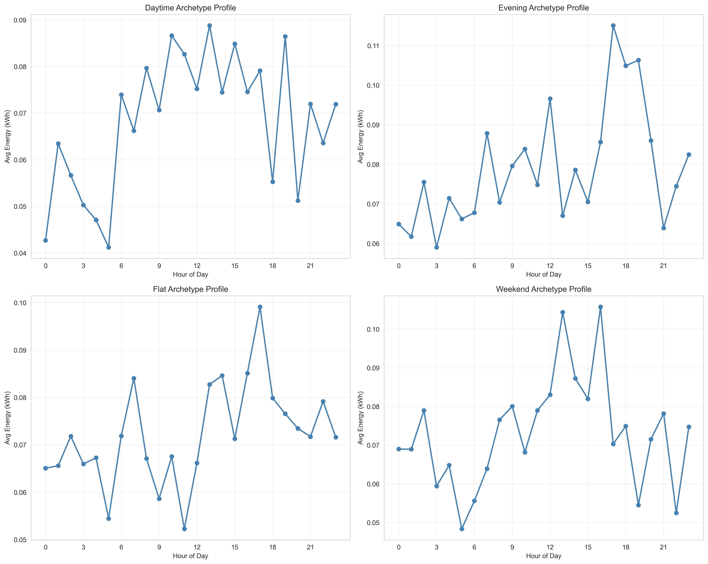
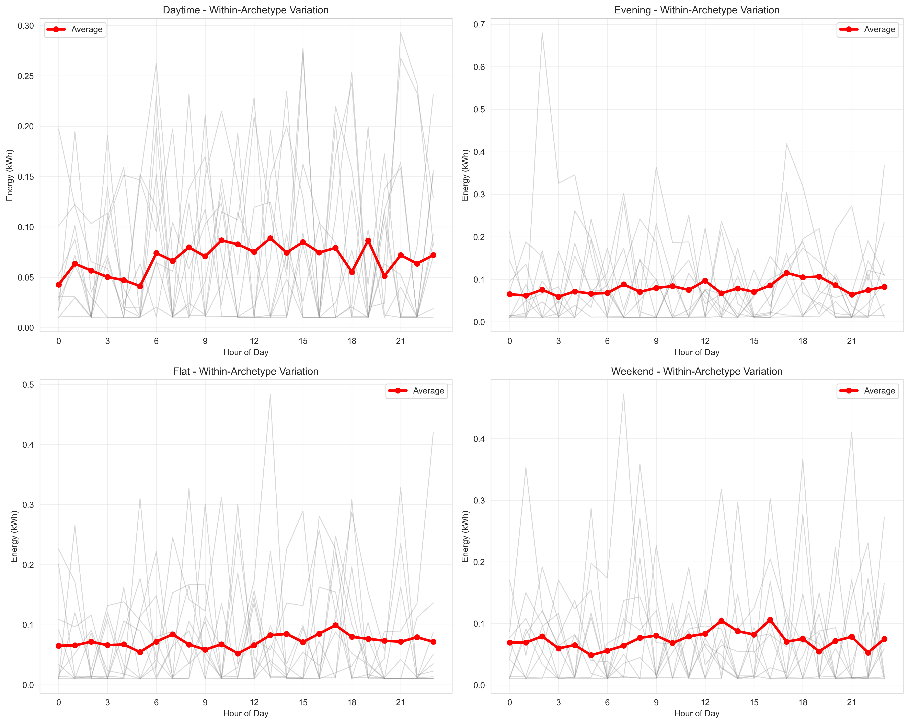
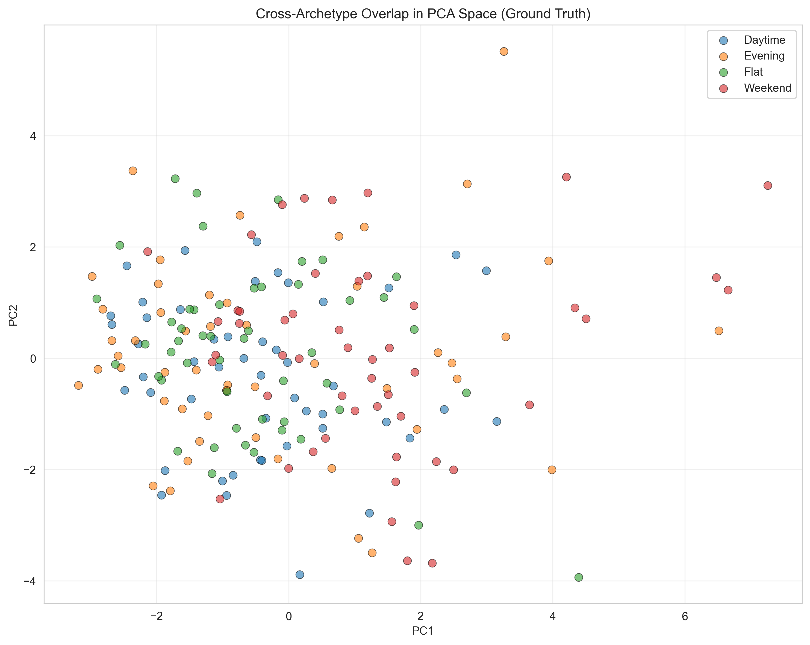
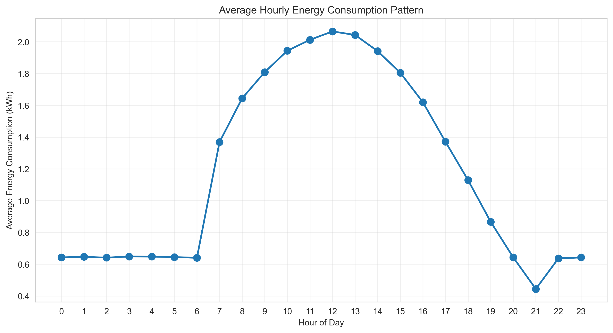
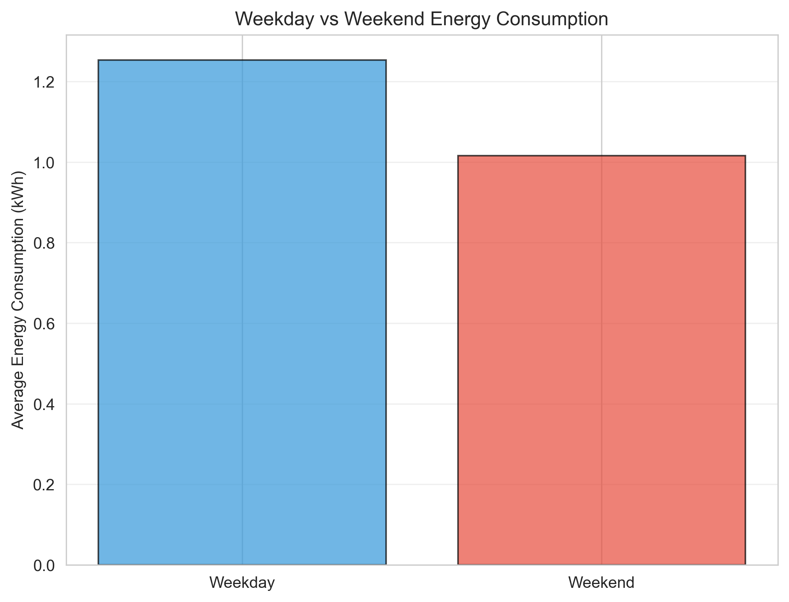
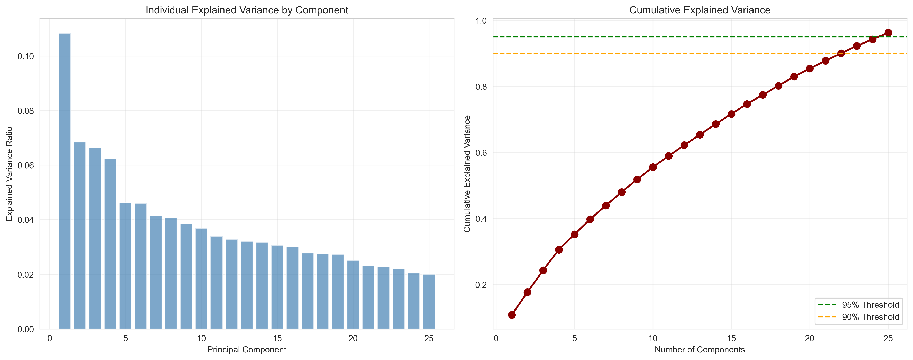
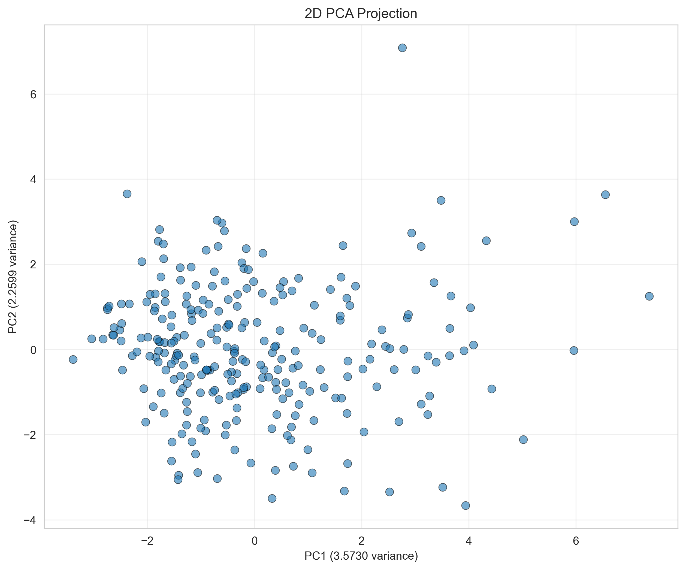
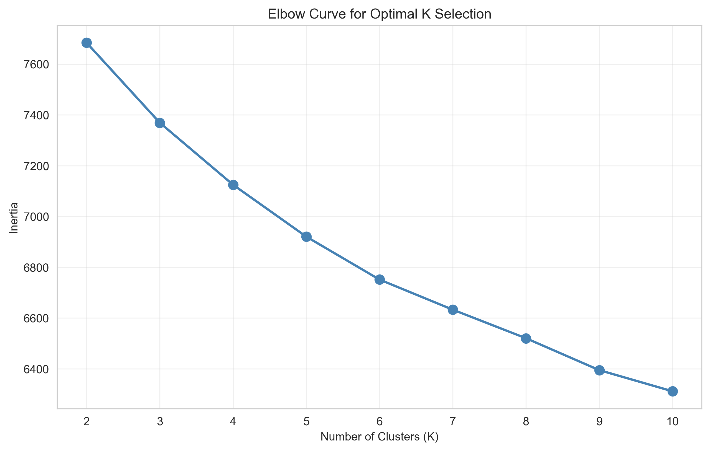
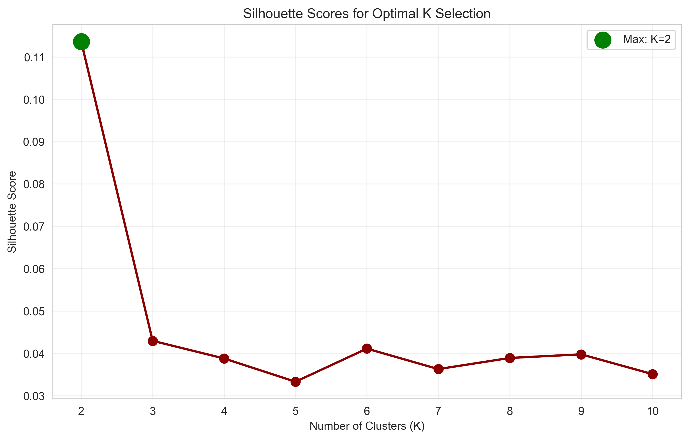
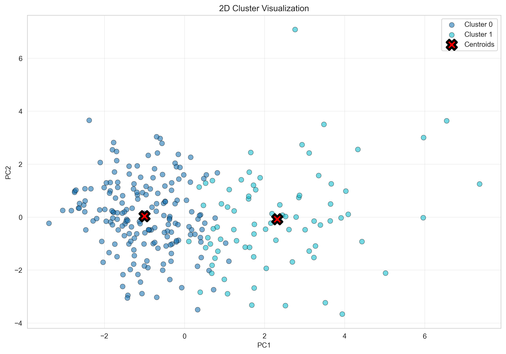

# Energy Consumption Pattern Analysis using PCA and K-Means

Undergraduate mini-project for AI-ML for Engineers. The goal is to group electricity consumers by **how** they use energy (timing, weekend preference, variability), not only by **how much** they use. The core methods stay **PCA** and **K-Means**.

**Data source: Synthetic (archetype-based).** Four latent load archetypes (daytime, evening, flat, weekend-heavy) generate the panel. Those labels are validation-only ground truth and are never passed into K-Means.

Repo: [shaxntanu/Energy-Consumption-Pattern-Analysis-using-PCA-and-K-Means](https://github.com/shaxntanu/Energy-Consumption-Pattern-Analysis-using-PCA-and-K-Means)

---

## Results at a glance

Default offline run (behavioral features, seed 42):

| Item | Value |
|------|--------|
| Consumers / days | 200 / 30 (hourly) |
| Modeling features | 33 behavioral |
| PCA components | 25 (95% cumulative variance) |
| Selected K | 2 |
| Silhouette at K=2 | 0.1055 |
| Stability (mean ARI) | 0.791 +/- 0.111 |
| Cluster sizes | 135 / 65 |

| Cluster | Name | Weekend ratio | Peak-to-avg | CV |
|---------|------|---------------|-------------|-----|
| 0 | Afternoon-Peak High-Variability | 0.95 | 7.11 | 1.07 |
| 1 | Weekend-Oriented Spiky-Variable | 1.20 | 10.64 | 1.32 |

Behavioral silhouette is honestly weak. Scale features look cleaner on metrics because magnitude separates easily. The primary experiment still uses behavioral features, because that matches the project claim.

---

## Dataset design

Instead of one shared daily curve with different base loads, each consumer draws from an archetype template, then gets amplitude, peak timing, shape noise, and weekday/weekend modifiers.

<p align="center">
  
</p>
<p align="center"><em>Mean 24-hour profiles by latent archetype</em></p>

<p align="center">
  
</p>
<p align="center"><em>Continuous variation inside each archetype (clusters are not perfectly separable by design)</em></p>

<p align="center">
  
</p>
<p align="center"><em>Cross-archetype overlap in the engineered feature space</em></p>

---

## Exploratory patterns

<p align="center">
  
</p>
<p align="center"><em>Population-average hourly consumption</em></p>

<p align="center">
  
</p>
<p align="center"><em>Weekday vs weekend consumption (population level)</em></p>

<p align="center">
  
</p>
<p align="center"><em>Distributions of key measured variables</em></p>

---

## PCA

Features are standardized. Components are kept until cumulative explained variance reaches at least 95%. Identifiers such as `consumer_id` are excluded from the modeling matrix.

<p align="center">
  
</p>
<p align="center"><em>Individual and cumulative explained variance</em></p>

<p align="center">
  
</p>
<p align="center"><em>2D PCA projection of consumers</em></p>

<p align="center">
  
</p>
<p align="center"><em>Loadings for the leading components (descriptive only; signs are not causal)</em></p>

---

## K-Means selection

K is searched from 2 to 10. For every K the pipeline records inertia, silhouette, Calinski-Harabasz, and Davies-Bouldin. The final K comes from multi-metric consensus, plus multi-seed stability (Adjusted Rand Index). There is no hard-coded preference for K in 3 to 6.

<p align="center">
  
</p>
<p align="center"><em>Elbow curve (inertia vs K)</em></p>

<p align="center">
  
</p>
<p align="center"><em>Silhouette score vs K</em></p>

<p align="center">
  
</p>
<p align="center"><em>Clusters in the first two principal components</em></p>

---

## What this project fixed

| Area | Before | After |
|------|--------|--------|
| Data | One shared 24h shape | Four archetypes with within-archetype variation |
| `weekend_ratio` | `mean(is_weekend)` (about 0.27 for every cluster) | `weekend_mean_energy / weekday_mean_energy` |
| Features | Scale mixed with electrical and shape | Primary run uses normalized behavioral shape |
| Preprocessing | Global forward/back fill | Sort by consumer and time; fill within consumer |
| Outliers | Global IQR deletions | Flag by default; keep legitimate peaks |
| K selection | Prefer K = 3 to 6 | Multi-metric consensus + stability |
| Dashboard | Recomputes PCA per page | One `AnalysisResults` object; config-hash invalidation |
| Dependencies | Loose `>=` pins | Exact versions in `requirements.txt` |

Baseline artifacts stay under `baseline/`. Longer notes live in `docs/BASELINE_VS_CORRECTED.md` and `docs/CHANGELOG.md`.

---

## Pipeline (short)

1. Build the archetype synthetic panel.
2. Validate schema, parse timestamps, sort by consumer and time, impute within consumer, check measurement ranges.
3. Engineer behavioral features: normalized 24h load shape, period shares, energy-based weekend ratio, peak-to-average, coefficient of variation.
4. Standardize, run PCA, keep components to the 95% cumulative-variance threshold.
5. Evaluate K-Means for K = 2 to 10; pick K with metrics and stability together.
6. Profile clusters in the original feature space and name them from measured behavior.
7. Write evidence-triggered recommendations (no guaranteed savings or causal claims).

Full write-ups: [`docs/METHODOLOGY.md`](docs/METHODOLOGY.md), [`docs/FINAL_REPORT.md`](docs/FINAL_REPORT.md), [`docs/DELIVERABLES.md`](docs/DELIVERABLES.md).

### Ablation

| Experiment | Feature set | Role |
|------------|-------------|------|
| A | Scale / magnitude | Control: what happens when magnitude dominates |
| B | Behavioral (normalized) | Primary pattern-segmentation run |
| C | Combined | Trade-off check |

See [`outputs/reports/ablation_study_report.md`](outputs/reports/ablation_study_report.md).

---

## Quick start

```bash
# Python 3.14.x (pinned stack tested on 3.14.0)
py -m pip install -r requirements.txt

# Tests
py -m pytest tests/ -v

# Full offline pipeline (writes models/ and outputs/)
py src/energy_analysis.py

# Dashboard (reads one AnalysisResults object)
py -m streamlit run app/app.py
```

Dashboard: `http://localhost:8501`

Pages: Overview, Methodology, EDA, PCA, K Selection, Cluster Profiles, Recommendations, Validation/Ablation, Limitations.

---

## Project structure

```
├── app/app.py                 # Streamlit dashboard
├── src/
│   ├── data_loader.py         # Archetype synthetic generator
│   ├── preprocessing.py       # Panel-aware cleaning
│   ├── feature_engineering.py # Behavioral / scale / combined sets
│   ├── pca_analysis.py        # PCA with variance threshold
│   ├── clustering.py          # Multi-metric K + stability
│   ├── cluster_profiling.py   # Profiles and names
│   ├── recommendation_engine.py
│   ├── energy_analysis.py     # End-to-end orchestrator
│   ├── run_ablation_study.py
│   └── validate_dataset.py
├── tests/
├── models/                    # Scaler, PCA, K-Means, metadata
├── outputs/{figures,metrics,reports}/
├── baseline/                  # Frozen pre-fix artifacts
├── docs/
├── audit_report.md
└── requirements.txt
```

---

## Reproducibility and integrity

- Package versions are pinned in `requirements.txt`.
- `models/analysis_metadata.json` stores feature list, PCA size, selected K, seeds, package versions, and timestamp.
- Metrics in the docs come from executed code, not hand-written numbers.
- Synthetic data is labeled as synthetic.
- Cluster differences are correlational, not causal.

## License

MIT. See [`LICENSE`](LICENSE).
