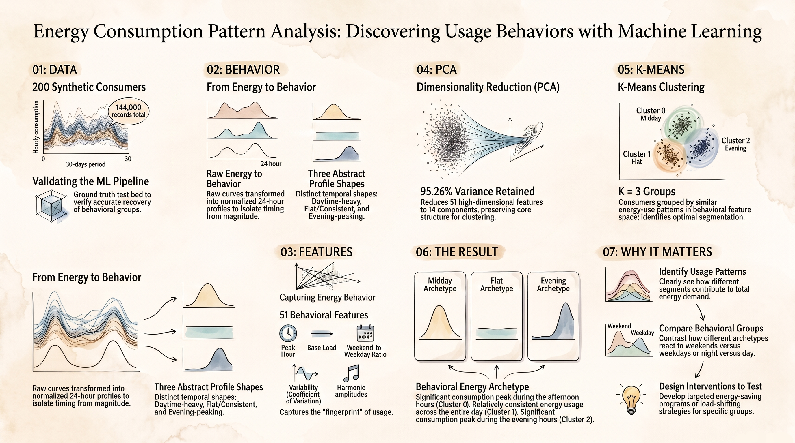

# Energy Consumption Pattern Analysis: PCA and K-Means

> Finding daily energy rhythms with machine learning. Households are grouped by
> **when** they use energy across the day, not by how much they use. This is the
> upgraded final project. It adds configurable horizons, an interpretable seasonal
> model, a longitudinal stability check, post-hoc explainability (SHAP), and a
> versioned web-artifact contract. The results are presented in a Vercel
> interactive explorer and a Streamlit simulator.

[](https://energy-consumption-pattern.vercel.app)
[](https://energy-consumption-pattern-vqrh.streamlit.app/)



| Item | Detail |
|------|--------|
| Reference run | Config **`99c7a6631340d301`**, seed **42**, **200 consumers × 365 days** (Jan-Dec 2024). This is the flagship year. Its numbers ship in `web/public/data/*.json` and are what the deployed Vercel explorer renders. Every table in this README that says "flagship" quotes that audited contract. |
| Current on-disk outputs | The last executed pipeline run is the **365-day flagship** (config `99c7a6631340d301`, 1,752,000 records, K = 4). `outputs/reports/analysis_summary.md` and `models/analysis_metadata.json` describe that window (generated 2026-09-04). The ablation and seed-robustness studies describe their own documented windows. The web contract is exported once and not re-read at deploy time. |
| Explorer | The [Vercel interactive explorer](https://energy-consumption-pattern.vercel.app) reads `web/public/data/*.json` only. No sklearn runs in the browser. |
| Simulator | Streamlit (`streamlit_app.py`), with 16 pages in 4 groups, a horizon control (30 / 90 / 180 / 365 days), and honest `available: false` handling for steps a short window cannot run. |
| Pipeline | A single deterministic flow: season → generate → preprocess → 51 behavioural features → StandardScaler → PCA (95%) → K-Means (evidence-based K) → explainability → profile + validate → seasonal + longitudinal → export artifacts. |

---

## 1. Overview: what this repo is for

The task is to group households by **how** they use energy across the day, not by **how much** they use. The pipeline finds that grouping without looking at the synthetic archetype that generated the data. The archetype is dropped before any statistic is computed and is only read back later for an independent validation check.

Four upgrades turn the base pipeline into the final project:

1. A **configurable horizon** with a **longitudinal stability** check, for any horizon in `{30, 90, 180, 365}` days from any `start_date`.
2. An **interpretable seasonal model** that separates magnitude from timing.
3. A **kept-separate real-world pathway** with a documented adapter and an internal-only validation scheme.
4. A **post-hoc explainability lane** (SHAP or a permutation fallback) plus a versioned **web-artifact contract**, so the Vercel explorer renders results without rerunning any analysis.

One bonus thread runs through the narrative: the [**Zephyr Station**](https://github.com/shaxntanu/Zephyr-Station) weather API that supplied the `season` column.

> **Reading headings:** every section opens with a one-line thesis so a reader can skim the pipeline in order.

---

## 2. Problem statement: group households by the shape of the day

Households with similar daily load curves should share demand-response advice, even when one uses twice as much energy as the other. The problem therefore asks for a shape-first segmentation. Two consumers with the same 24-hour profile, scaled differently, should cluster together. Two with the same daily total but opposite peak hours should not.

The synthetic generator stands in for a meter fleet we do not ship in this repo. It draws each consumer from a small set of archetypes (flat, daytime-peaking, evening-peaking, weekend-active), each with its own hourly shape, seasonal phase, and noise. The true archetype is a hidden label, useful only after clustering as an independent check. Internal indices alone cannot know how many latent groups exist. This repo reports that limit as a result rather than hiding it. See section [10](#10-results-synthetic): the evidence-based rule lands on `K = 4` on the flagship, and the independent archetype check confirms 4 latent groups at ARI 0.81.

---

## 3. Objectives: what a passing run must establish

- **Objective 1:** a reproducible pipeline that, from raw hourly kWh rows, produces a compact shape space (PCA), a principled choice of K, and interpretable cluster profiles.
- **Objective 2:** long-horizon and seasonal behaviour are first-class. The pipeline accepts any horizon in `{30, 90, 180, 365}` days from any `start_date`, and it measures separately whether the segmentation holds across time and across seasons.
- **Objective 3:** real-world validation is possible through a documented adapter that maps an external meter dataset onto the same analysis, without ever inventing an ARI/NMI score for real data.
- **Objective 4:** explainability (SHAP or an honest fallback) accompanies every recovered cluster, and the artifact contract lets the Vercel explorer render the results without rerunning any analysis.

---

## 4. Dataset: synthetic (controlled) plus real-world (external)

No real consumption dataset ships in this repo. Two pathways feed the same analysis code.

### 4.1 Synthetic branch (the controlled, audited dataset)

| Property | Value |
|----------|-------|
| Consumers | **200** |
| Horizon | **365 days**, `2024-01-01` to `2024-12-30` (the flagship window in `web/public/data/manifest.json`) |
| Cadence | hourly `energy_consumption_kwh` per consumer |
| Records after preprocessing | **1,752,000** |
| Hidden archetypes | 4: `flat`, `daytime`, `evening`, `weekend` |
| Seed | **42**, config hash **99c7a6631340d301** |
| Package versions | pandas 3.0.0, numpy 2.3.5, scikit-learn 1.9.0, scipy 1.18.0, matplotlib 3.10.8, seaborn 0.13.2, plotly 6.5.2, streamlit 1.62.0, joblib 1.5.3 |

Generator coverage per consumer-day: `hourly_kwh_by_meter`, `season` (kept), `archetype` (dropped before any statistic), `seasonal_phase` (dropped), `timestamp`.

A **30-day reference window** (config `6896387297178841`, 144,000 records, K = 3) remains the `REFERENCE_HASH` the Streamlit simulator uses to label a run as the audited reference vs a new setting. The on-disk `outputs/reports/analysis_summary.md` and `models/analysis_metadata.json` currently reflect the 365-day flagship run (config `99c7a6631340d301`, generated 2026-09-04). The flagship tables in this README quote that same run.

### 4.2 Real-world branch (adapter to ingestion to internal-only validation)

A second pathway runs `src/dataset_adapter.py` to `src/realworld_ingest.py` to `src/realworld_validate.py`, orchestrated by `src/run_realworld.py`.

| Column mapping | Panel key |
|----------------|-----------|
| meter / consumer id | `meter_id` |
| timestamp | `timestamp` (parsed; continuity accounting) |
| meter reading | `energy_consumption_kwh` (unit conversion + validation) |
| source label | `source` |

Adapters shipped: a built-in **UCI Individual household electric power consumption** adapter, and a generic `generic_csv` adapter that maps any compatible panel by column name. The ingestion reports every schema, timestamp, duplicate, unit, and continuity decision. In this repo the pathway is implemented and tested but not yet executed. No `outputs/reports/real_world_demo_panel.md` exists on disk. The deployed explorer's real-world card ships the shared codebase's documented 24-meter demo run. Run `py run_module.py run_realworld -- --demo` to reproduce it here (section 13).

> The UCI archive is cited by name and by URL in the adapter's docstring. No dataset file is redistributed.

### 4.3 Zephyr Station: where `season` came from

The `season` column is not hand-typed synthetic metadata. It is derived from a real weather station the author built and operated, called **Zephyr Station**:

- Firmware + HTTP API: [`github.com/shaxntanu/Zephyr-Station`](https://github.com/shaxntanu/Zephyr-Station). An ESP-based logger exposing `/api/weather` on the local network.
- Dashboard + logger: [`github.com/shaxntanu/Zephyr-Station-Dashboard`](https://github.com/shaxntanu/Zephyr-Station-Dashboard). Polls the API, stores a time series, and renders the dashboard.
- Pipeline seam: the consumer panel is joined to the logged weather history by month, and the pipeline maps `month -> season` so every consumer-day carries a `season` label before any modeling happens. The hidden `seasonal_phase` synthetic truth is dropped at the same time as `archetype`, so the model never peeks at it.

---

## 5. Preprocessing: from raw meter rows to a modeling table

The PRE-PROCESSING stage is first-class and owns every fix before any descriptive statistic is computed.

| Step | What happens |
|------|--------------|
| Deduplicate | Exact `(meter_id, timestamp)` duplicates are flagged and deduped; counts go in the ingestion log. |
| Parse timestamps | Robust parsing, with failed rows recorded and dropped only after accounting. |
| Fill short gaps | Within-meter imputation (never cross-consumer). Longer gaps are left as missing and later accounted in continuity. |
| Cap extremes | Per-consumer winsorization, not deletion. Extreme kWh outliers are capped at a high percentile so no consumer is silently removed. |
| Sort | Panel sorted by `(consumer, timestamp)` at the end, so every downstream day can be assumed contiguous. |
| Leakage boundary | `archetype` and `seasonal_phase` are dropped before this stage computes anything. `season` is kept as the only seasonal signal. |

Feature selection happens later. Preprocessing only touches raw rows.

---

## 6. Feature engineering: 51 behavioural features, clustered by when, not how much

The question is how energy is used across the day. Features are therefore behavioural and, where possible, invariant to a consumer's scale.

| Group | Count | Examples | Says what |
|-------|-------|----------|-----------|
| Shape (24) | 24 | `hour_0_shape` to `hour_23_shape`, the daily load curve divided by its own daily mean | The normalized 24-hour profile itself. Two consumers with the same shape at different scales look identical here. |
| Summary (27) | 27 | `morning/afternoon/evening/night_share`, `night_day_ratio`, `peak_hour_sin`/`cos`, `peak_concentration`, `profile_ramp`, `harmonic_1/2/3_amplitude`, `haar_detail_*`, `shape_entropy`, `shape_gini`, `base_load_share`, `peak_to_avg_ratio`, `coefficient_of_variation`, `daily_total_cv`, `p90_median_ratio`, `weekend_ratio`, `weekend_shape_distance`, `weekend_cv_ratio`, `skewness`, `kurtosis` | How that shape varies: timing, spikiness, weekend behaviour, dispersion. |

Key design choices:

- The **24-hour shape** carries the primary signal. The 27 summaries carry secondary cues. PCA never sees the raw 24 hourly values.
- **`load_factor` is excluded** downstream. It correlates highly with the remaining summaries, and keeping it would double-count one axis of variation (recorded in the docs and verification).
- Scale-invariance is tested explicitly. `tests/test_features.py` verifies that a uniform scaling of the profile changes the scale diagnostics and not the shape group.

The panel fed to PCA is 200 rows (consumers) × 51 features on the flagship.

---

## 7. PCA: StandardScaler, a variance threshold (95%), and two comparison rules

| Property | Value (flagship) |
|----------|------------------|
| Input | 51 selected behavioural features (consumer-level) |
| Scaling | `StandardScaler` (fitted on consumers, not on meter-hours) |
| Rule that drives the pipeline | Cumulative-variance threshold 95% |
| Components retained | **10** |
| Cumulative variance retained | **0.9505** |
| Comparison rules (computed and reported, never used to override) | Kaiser (eigenvalue > 1): **7**, Scree elbow: **7** |

**Weights vs loadings.** The pipeline stores both. *Weights* are unit eigenvectors, used for reconstruction. *Loadings* are the correlations between original features and the projected scores, used for interpretation. When you describe what a component means, quote the loadings.

**Loadings summary (PC1-PC5)**. Top 5 absolute loadings per component, from `web/public/data/pca.json`. Each value is an `r`, not a weight:

- PC1: `profile_ramp` +0.92, `peak_concentration` +0.88, `harmonic_2_amplitude` +0.88, `p90_median_ratio` +0.87, `coefficient_of_variation` +0.87.
- PC2: `night_day_ratio` +0.92, `afternoon_share` -0.87, `hour_0_shape` +0.84, `hour_14_shape` -0.84, `hour_13_shape` -0.84.
- PC3: `hour_7_shape` +0.87, `hour_8_shape` +0.87, `hour_6_shape` +0.74, `morning_share` +0.74, `hour_9_shape` +0.58.
- PC4: `hour_17_shape` +0.56, `hour_18_shape` +0.54, `hour_6_shape` +0.50, `hour_5_shape` +0.47, `hour_23_shape` -0.43.
- PC5: `haar_detail_l3` +0.54, `weekend_ratio` -0.51, `kurtosis` -0.38, `skewness` -0.38, `weekend_cv_ratio` -0.37.

The full 51 × 10 loadings matrix is in `outputs/metrics/pca_loadings.csv` for the last executed run, and the top loadings per component are in `web/public/data/pca.json` for the flagship. On the archived 30-day reference the threshold kept 14 components / 0.9526.

The variance curve (explained + cumulative) is rendered on the **PCA** slide of the explorer. The 2D score plot lives in the static report (`pca_projection_2d.png`).

---

## 8. K-Means: evidence-based K selection with a parsimony guard

| Property | Value (flagship) |
|----------|------------------|
| Input | The 10 PCA scores (one point per consumer, deterministic) |
| Candidates | K = 2 to 10 |
| Selected K | **4** |
| Silhouette at K = 4 | **0.3283** |
| Stability at K = 4 | mean pairwise **ARI 0.9947** (sd 0.0071), assignment agreement 0.998 across 10 restarts |
| Inertia elbow (reported for context only) | **K = 4**, shown but never allowed to override the composite pick |
| Cluster sizes | **[39, 52, 47, 62]** |

**The composite rule (pre-registered, never tuned to the hidden archetype).** For each admissible K, the pipeline min-max normalizes three indices, silhouette (higher is better), Calinski-Harabasz (higher is better), and inverted Davies-Bouldin, averages the three, and applies a 5% tolerance band. If the best-scoring K and a smaller K are within 0.05 composite points, the smaller K wins, so parsimony is built in. Inertia is not part of the composite. It is shown for comparison and labelled as such.

**The flagship sweep** (365-day, config `99c7a6631340d301`, from `web/public/data/clustering.json`). The composite score peaks at K = 4 with 0.9444, and K = 4 alone sits inside the tolerance band:

| K | Inertia | Silhouette | Calinski-Harabasz | Davies-Bouldin | Stability ARI |
|---|---------|------------|-------------------|----------------|---------------|
| 2 | 7083.5 | 0.2939 | 73.0 | 1.3823 | 0.9958 |
| 3 | 4968.5 | 0.3305 | 93.7 | 1.1957 | 0.9852 |
| **4 ★** | **3911.1** | **0.3283** | **96.6** | **1.1691** | **0.9947** |
| 5 | 3466.1 | 0.3352 | 87.6 | 1.2023 | 0.9587 |
| 6 | 3072.5 | 0.3238 | 83.6 | 1.2326 | 0.9909 |
| 7 | 2844.6 | 0.3164 | 77.5 | 1.2094 | 0.8931 |
| 8 | 2670.3 | 0.3072 | 72.2 | 1.2950 | 0.8651 |
| 9 | 2490.6 | 0.3111 | 69.1 | 1.2015 | 0.8156 |
| 10 | 2361.6 | 0.2760 | 65.6 | 1.3180 | 0.7581 |

K = 5 has the single highest silhouette (0.3352), but it loses the composite to K = 4 (0.9444 vs 0.8210), K = 4 matches the inertia elbow, and independently is exactly where the hidden-archetype check peaks (ARI 0.81, section [10](#10-results-synthetic)). No other K sits inside K = 4's 5% tolerance band, so the parsimony tie-break is not even needed. On the 30-day reference the same rule chooses K = 3. On a full year it recovers all four latent groups. The K-selection trace (filtered sets, raw and normalized scores, the tolerance tie-break) is in `outputs/metrics/k_selection_trace.json` and `web/public/data/clustering.json`.

---

## 9. Evaluation: which metric answers which question

| Metric | Synthetic branch | Real-world branch | Why it belongs there |
|--------|----------------|-------------------|----------------------|
| Adjusted Rand Index (ARI) | yes, vs hidden archetype | never | Controlled validation, only meaningful when ground truth is known. |
| Normalized Mutual Information (NMI) | yes, vs hidden archetype | never | An independent check after clustering, never during fitting. |
| Silhouette | yes (reported alongside ARI) | yes | Internal cohesion/separation. Works without labels. |
| Calinski-Harabasz | yes | yes | Variance-ratio separation. |
| Davies-Bouldin | yes | yes | Lower is better, cluster compactness vs separation. |
| Seed stability (mean pairwise ARI) | yes | yes | Revisits K-Means from 10 different seeds. A fragile K collapses here. |
| Temporal stability (mean pairwise ARI) | yes (full window vs segments) | yes | Re-fits the whole recipe on time segments. A spurious partition does not survive. |

Fabricating an ARI for real data (by inventing labels) is never done. The real-world pathway carries only the internal column.

---

## 10. Results: synthetic (the audited flagship run, config `99c7a6631340d301`)

The four clusters of the flagship run (all values from `web/public/data/profiles.json` and `validation.json`):

| Cluster | Name | Size | Peak hour | Evening share | Peak-to-average | CV | Mean kWh / record* |
|---------|------|------|-----------|---------------|-----------------|----|--------------------|
| 0 | Midday-Peaking Weekday-Heavy | 39 (19.5%) | 13:00 | 0.2118 (pop 0.2900) | 8.8321 (pop 8.5918) | 0.620 (pop 0.550) | 1.30 |
| 1 | Flat All-Day | 52 (26.0%) | 19:00 | 0.2576 (pop 0.2900) | 4.9204 (pop 8.5918) | 0.302 (pop 0.550) | 1.38 |
| 2 | Evening-Peaking | 47 (23.5%) | 20:00 | **0.3795** (pop 0.2900) | **11.3222** (pop 8.5918) | 0.705 (pop 0.550) | 1.38 |
| 3 | Evening-Peaking Weekend-Heavy | 62 (31.0%) | 19:00 | 0.2987 (pop 0.2900) | 9.4502 (pop 8.5918) | 0.596 (pop 0.550) | 1.32 |

*\*Mean kWh per hourly record is shown as context only. It never drove the feature engineering, which operates on the normalized daily shape.*

Recovery against the hidden archetypes (from `web/public/data/validation.json`). The labels were dropped before any statistic, so this is an independent check:

| K | ARI | NMI | Silhouette |
|---|-----|-----|------------|
| 2 | 0.2875 | 0.4565 | 0.2939 |
| 3 | 0.6017 | 0.6801 | 0.3305 |
| **4 ★** | **0.8127** | **0.8284** | 0.3283 |
| 5 | 0.7653 | 0.8021 | **0.3352** |
| 6 | 0.7528 | 0.7816 | 0.3238 |
| 7 | 0.7347 | 0.7768 | 0.3164 |
| 8 | 0.6915 | 0.7534 | 0.3072 |
| 9 | 0.6760 | 0.7543 | 0.3111 |
| 10 | 0.5978 | 0.7301 | 0.2760 |

Crosstab at the selected K = 4 (from `web/public/data/validation.json`):

| archetype | cluster 0 | cluster 1 | cluster 2 | cluster 3 |
|-----------|-----------|-----------|-----------|-----------|
| daytime | **39** | 1 | 0 | 10 |
| evening | 0 | 0 | **47** | 3 |
| flat | 0 | **50** | 0 | 0 |
| weekend | 0 | 1 | 0 | **49** |

> **This agreement is the result.** The evidence-based rule landed on K = 4 and the independent check confirms it. Recovery is highest at K = 4 (ARI 0.81, NMI 0.83), which is also where the inertia elbow points. Silhouette alone peaks at K = 5 (0.335), but K = 4 sits inside the 0.05 tolerance band and wins the composite. That is the clean outcome a principled rule is supposed to produce. The contrast with the 30-day reference window (config `6896387297178841`) is the honest lesson. There the same rule chose K = 3 with recovery ARI 0.61, and the `weekend` archetype scattered across clusters. On a real dataset that gap would be undetectable. This is a known limit of unsupervised clustering, and the report states it plainly.

**On this window:** because the flagship is a full year, seasonal and longitudinal are `available: true`. See sections [11](#11-results-seasonal) and [12](#12-results-longitudinal). The 30-day reference is the only horizon on which they are honestly skipped (`LONGITUDINAL_MIN_DAYS = 180`).

---

## 11. Results: seasonal (magnitude vs timing, interpretable)

The seasonal model separates **magnitude changes** (how much the daily total moves across seasons, mean-corrected) from **shape/timing changes** (when the daily peak occurs, renormalized so it never changes a daily total). Seasonal phase is drawn independently of archetype (separate seed stream), so the check is not simply "do archetypes have different seasons."

From `web/public/data/seasonal.json`, the **365-day / 200-consumer flagship** (config `99c7a6631340d301`):

- Seasons present: `winter`, `spring`, `summer`, `autumn`. Mean daily kWh: winter 26.571, spring 35.167, summer 38.014, autumn 29.433. Peak hours: autumn 19, spring 20, summer 20, winter 19.
- Estimated magnitude amplitude (fractional swing of daily totals): **0.202** (IQR 0.179-0.216 across 200 consumers).
- Pearson *r* between season-level estimate and the hidden phase (185 consumers with a hidden phase): **0.678**. Peak-season label agreement **0.885**.

For a 30-day run the pipeline honestly returns `seasonal: {available: false}` and logs "no 'season' column with ≥ 2 distinct values." With only January present there is nothing to compare. The explorer shows that skip instead of a fake chart (see the **Seasonal** slide/page).

---

## 12. Results: longitudinal (does the segmentation hold up over time?)

The whole analysis, feature engineering, scaling, PCA, and K-selection, is re-fit inside each non-overlapping segment of the same consumers. Segment labels are then compared with the full-window labels by permutation-invariant **ARI**. A high, flat value means the groups are a property of the consumers, not of the month or season.

From `web/public/data/longitudinal.json`, the **365-day / 200-consumer flagship** (config `99c7a6631340d301`):

- Segments: `2024-01-01 -> 2024-04-01`, `2024-04-01 -> 2024-07-01`, `2024-07-01 -> 2024-09-30`, `2024-09-30 -> 2024-12-30` (4 segments, 200 consumers each).
- Optimal K from the full-window run at that horizon: **4**.
- Segment ARI vs full window: **[0.838, 0.892, 0.946, 0.851]**, mean temporal stability **0.882**.
- Monthly mean daily kWh (for context): Jan 26.1 to Jun 39.4 to Dec 25.3. The energy story is seasonal in magnitude, but the consumer groups persist. The winter-spring re-sort at 0.84 is the weakest of the four segments and still strong.

For a 30-day run the pipeline honestly returns `longitudinal: {available: false}` and logs "Longitudinal analysis was not run for this window (needs ≥ 180 days)." The threshold reflects that both halves must be long enough to be real samples.

---

## 13. Results: real-world (internal-only, pathway available, not yet executed here)

The real-world pathway is fully implemented (`run_realworld.py -- --demo` reproduces the smoke validation) but has not been executed in this repo yet. The deployed explorer's real-world card ships the shared codebase's documented demo run:

| Property | Value |
|----------|-------|
| Meters | **24** · 12,096 meter-hours · 51 features per meter |
| PCA | **5** components (95.5% variance) |
| Selected K | **2** (candidates 2-7) |

| Metric at K = 2 | Value |
|-----------------|-------|
| Silhouette | **0.7194** |
| Calinski-Harabasz | 123.2 |
| Davies-Bouldin | 0.3966 |
| Seed-stability ARI (10 restarts) | **1.0000** |
| Temporal stability (3 windows, mean pairwise ARI) | **1.0000** |

> No ARI/NMI column is ever printed for real data. The synthetic evaluation lives only in section [10](#10-results-synthetic).

---

## 14. Results: ablation and seed robustness (does the feature set matter?)

Both studies below are the **current on-disk 30-day outputs** (`outputs/metrics/ablation_study_results.csv`, `seed_robustness_by_seed.csv`, `seed_robustness_summary.csv`). They use the same arms, seeds, and rule as the flagship, on the last executed window.

### Ablation (5 arms, same seed, same K rule)

| arm | n_features | n_pca_components | optimal K | silhouette | CH | DB | stability ARI | archetype ARI | shape separation |
|-----|------------|-----------------|-----------|------------|----|----|---------------|---------------|------------------|
| scale | 7 | 2 | 2 | 0.521 | 230.2 | 0.783 | 0.983 | -0.004 | 0.041 |
| shape | 24 | 8 | 4 | 0.323 | 81.6 | 1.189 | 0.987 | 0.646 | **0.713** |
| summary | 27 | 11 | 2 | 0.321 | 97.7 | 1.085 | 0.986 | 0.321 | 0.302 |
| **behavioral (shipped)** | **51** | **14** | **3** | 0.312 | 86.4 | 1.254 | 0.988 | **0.614** | 0.617 |
| combined | 58 | 15 | 3 | 0.279 | 72.6 | 1.386 | 0.983 | 0.623 | 0.615 |

### Seed robustness across 20 independent datasets (seeds `1...19, 42`)

| arm | n_features | ARI mean (sd) | silhouette mean | stability mean | shape separation mean | K modal (range) | times rule selected |
|-----|------------|---------------|-----------------|----------------|-----------------------|-----------------|---------------------|
| **behavioral** | **51** | **0.641 (0.115)** | 0.311 | 0.987 | 0.633 | 3 (3-4) | 7 / 20 |
| summary | 27 | 0.610 (0.240) | 0.319 | 0.994 | 0.540 | 3 (2-4) | **9 / 20** |
| combined | 58 | 0.601 (0.032) | 0.279 | 0.986 | 0.620 | 3 (3-3) | 0 |
| shape | 24 | 0.589 (0.073) | 0.317 | 0.978 | 0.662 | 3 (3-5) | 4 / 20 |
| scale | 7 | 0.013 (0.036) | 0.521 | 0.987 | 0.085 | 2 (2-6) | 0 |

- Exact paired permutation tests across the 5 arms (`method: exact` in `seed_robustness_tests.csv`): **behavioral vs `scale` is highly significant** (raw p = 1.9 × 10^-6, Holm 1.9 × 10^-5). **behavioral vs `shape` is not** (raw p = 0.123, Holm 0.74).
- So `behavioral` has the best mean ARI (0.641) and is the **shipped** `feature_set`. But on a per-dataset basis the pre-registered rule picked `summary` 9/20 and `behavioral` 7/20. The top arms are statistically indistinguishable from each other. Reporting `behavioral` as "the demonstrated best feature set" would overstate the evidence. It is the best mean with a reasonable story (shape-led, scale-invariant), and the honest nuance is recorded here.

Full reports: `outputs/reports/ablation_study_report.md`, `outputs/reports/seed_robustness_report.md`, plus the `seed_robustness.png` and `ablation_comparison.png` figures.

---

## 15. Explainability (XAI): SHAP or an honest fallback

The pipeline calls `src/explainability.py` right after clustering and before profiling. A small surrogate random forest learns the recovered cluster labels from the 51 behavioural features, then feature attribution runs on that surrogate:

- if `shap` is installed: **SHAP `TreeExplainer`**,
- otherwise: **permutation importance** (one-vs-rest per cluster).

On the 365-day flagship, `web/public/data/explainability.json` exports `available: true, method: "shap", cv_balanced_accuracy: 0.985`, with per-cluster drivers:

- cluster 0 (Midday-Peaking Weekday-Heavy): `afternoon_share` 0.142, `hour_14_shape` 0.109, `hour_2_shape` 0.076.
- cluster 1 (Flat All-Day): `base_load_share` 0.175, `coefficient_of_variation` 0.091, `shape_entropy` 0.060.
- cluster 2 (Evening-Peaking): `evening_share` 0.126, `peak_concentration` 0.123, `harmonic_2_amplitude` 0.107.
- cluster 3 (Evening-Peaking Weekend-Heavy): `weekend_ratio` 0.250, `peak_hour_cos` 0.091, `peak_hour_sin` 0.049.

`cv_balanced_accuracy` (stratified 5-fold) is an honest ceiling for how well the explanations can track the clusters. It is shown as a badge in the explorer, not as a claim that the clusters are that accurate. On windows where explainability was not run, the contract honestly returns `available: false` and the **Profiles** page/slide shows a clear fallback badge rather than an invented bar chart.

---

## 16. Visualizations: gallery

Every figure named below can be regenerated by re-running the analysis that produced it. Static figures live in `outputs/figures/*.png` (light mode) and `dark_mode_plots/figures/*.png` (dark mode, generated by the scripts in `presentation/`, see section 22.3).

- `explained_variance.png`: cumulative variance vs components retained.
- `elbow_curve.png`: inertia curve with the estimated elbow.
- `silhouette_scores.png`: per-K silhouette bars.
- `k_selection_metrics.png`: the composite min-max sweep underlying the K rule.
- `pca_projection_2d.png`: score scatter colored by cluster.
- `component_loadings.png`: top-5 loadings per PC.
- `cluster_visualization_2d.png`: consumer positions in the score space.
- `archetype_recovery.png`: ARI/NMI per K (peak recovery marks the selected K on the flagship, see section 10).
- `archetype_crosstab.png`: crosstab heatmap at the selected K.
- `seasonal_mean_shape_by_season.png`: per-season mean shape (when seasonal is available).
- `seasonal_daily_energy_and_peak_hour.png`: magnitude vs timing by season.
- `seasonal_phase_recovery.png`: estimated vs true phase.
- `longitudinal_cluster_stability.png`: segment ARI and monthly trend.
- `shap_cluster_importance.png`: per-cluster drivers (SHAP or permutation).
- `seed_robustness.png` and `ablation_comparison.png`: the robustness story.
- EDA set: `distributions.png`, `hourly_patterns.png`, `weekday_weekend_comparison.png`, `correlation_heatmap.png`, `consumption_variability.png`, `boxplots_by_time.png`.

The Vercel explorer re-renders the same numbers interactively, see the next section.

---

## 17. Vercel interactive explorer: what lives on the web, what stays offline

**Offline (Python, once per run):** every analysis step writes the artifact contract under `web/public/data/` via `src/export_artifacts.py`.

**Online (browser, always):** `web/` (Vite 7, React 19, Chart.js 4 using `react-chartjs-2`, Framer Motion, GSAP) only reads those JSON files. No model ever runs client-side.

| File under `web/public/data/` | What the explorer renders |
|-------------------------------|---------------------------|
| `manifest.json` | Run identity (hash, window, consumers, package versions). |
| `pca.json` | Variance curve, per-PC loadings, three-rule comparison. |
| `clustering.json` | K sweep, stability, the selection trace (permissible filter, composite scores, tolerance tie-break). |
| `profiles.json` | 24-hour mean shape per cluster, period shares, `size_share`. |
| `validation.json` | Recovery by K plus crosstab (synthetic only). |
| `seasonal.json` | Magnitude vs timing plus phase recovery (`available: true` on the flagship, `false` at 30 days, with a reason). |
| `longitudinal.json` | Segment ARI plus monthly trend (`available: true` on the flagship, `false` at 30 days). |
| `explainability.json` | Per-cluster drivers, with `method: "shap"` and `cv_balanced_accuracy: 0.985` on the flagship. |

The contract is **versioned** (`contract_version 1.0.0`), append-only, typed, with stable keys, and returns `available: false` plus a `reason` for every skipped step. The reader in `web/src/analysisData.js` is the only bridge to the browser. `web/src/main.jsx` renders the seven-slide carousel (overview, dataset, feature engineering with the six shape-feature reveal, PCA, choosing K, the four clusters, and validation), topped by a ScienceHighlights band carrying the seasonal, longitudinal, explainability, and real-world badges.

---

## 18. Methodology flow: the single pipeline the repo actually runs

The mandatory flow, as rendered at `docs/flow_diagram.md`:

```mermaid
flowchart LR
    START([**START**]) --> COLLECT[/**DATA COLLECTION**/<br>two pathways/]

    COLLECT --> SYN[**Synthetic data**<br>generate_synthetic_data<br>archetypes known]
    COLLECT --> RW[**Real-world data**<br>dataset_adapter -> realworld_ingest<br>no ground truth]

    SYN --> VAL[[**DATA VALIDATION**<br>schema, duplicates, timestamps,<br>within-meter imputation]]
    RW --> VAL

    VAL --> PRE[**PRE-PROCESSING**<br>preprocess_pipeline<br>clean, impute, sort]
    PRE --> FEAT[**FEATURE ENGINEERING**<br>behavioural shape, scale-invariant]
    FEAT --> SCALE[**FEATURE SCALING**<br>StandardScaler]
    SCALE --> PCA[**PCA**<br>variance threshold + loadings]
    PCA --> KM[**K-MEANS**<br>evidence-based K]

    KM --> EVAL[/**MODEL EVALUATION**/]

    EVAL -->|synthetic branch| ARI[**NMI / ARI vs hidden archetype**<br>+ silhouette / CH / DB<br>+ seed stability]
    EVAL -->|real-world branch| INT[**Internal only**<br>silhouette / CH / DB<br>+ seed stability + temporal stability<br>(never ARI/NMI against invented labels)]

    ARI --> VIZ[**VISUALIZATION**<br>PCA, cluster, K-selection,<br>seasonal, longitudinal charts]
    INT --> VIZ

    VIZ --> INTERP[**INTERPRETATION**<br>cluster profiles + loadings<br>+ seasonal / longitudinal findings]
    INTERP --> END([**END**])
```

**PRE-PROCESSING and VISUALIZATION are first-class, clearly visible stages.** They are distinct blocks in the diagram, distinct sections of this README, and their code lives in dedicated modules (`preprocessing.py`, the chart producers under `src/`, and the explorer).

**The thesis of the whole flow:** this clustering groups consumers by *when* they use energy, not *how much*. That thesis is operationalized as the behavioural 51-feature engineering, plus the evidence-based 365-day/200-consumer evaluation (K = 4, ARI 0.81).

---

## 19. Innovation: the four research improvements plus the XAI bonus

| Improvement | What it adds | Key insight reported in this run |
|-------------|--------------|----------------------------------|
| 1. Configurable horizon + longitudinal check | `AnalysisConfig(start_date, duration_days, LONGITUDINAL_MIN_DAYS=180)`; `longitudinal_analysis.py` re-fits the whole recipe per segment and measures permutation-invariant ARI. | 365-day flagship: mean temporal ARI **0.882** (segments [0.838, 0.892, 0.946, 0.851]); honestly skipped at 30 days. |
| 2. Interpretable seasonal model (magnitude vs timing) | `SeasonalConfig`; per-consumer phase drawn independently of archetype; magnitude is mean-corrected, timing is renormalized. | 365-day flagship: magnitude amplitude **0.202**, phase *r* **0.678**, peak-season agreement **0.885**. |
| 3. Real-world pathway, kept separate | `dataset_adapter` to `realworld_ingest` to `realworld_validate` to `run_realworld`; generic adapter + UCI built-in; documented mapping, validation, unit handling. | Implemented in this repo; the demo (24 meters, K = 2, silhouette 0.719, seed stability 1.000) is reproducible via `py run_module.py run_realworld -- --demo`. No ARI column is ever printed for real data. |
| 4. Versioned web-artifact contract | `export_artifacts.py` writes `web/public/data/*.json` (`contract_version 1.0.0`) so the Vercel explorer renders without rerunning analysis; every skipped step is `available: false` plus a `reason`. | The deployed explorer and this README quote the same contract JSONs. |
| Bonus: XAI / SHAP | `explainability.py` runs post-hoc SHAP `TreeExplainer` when `shap` is installed, and a permutation fallback otherwise. | On the flagship: `available: true`, `method: "shap"`, `cv_balanced_accuracy` **0.985**; cluster drivers in `explainability.json` (see section 15). |

No fabricated numbers appear anywhere. The explorer marks every skipped step `available: false` with a `reason`.

---

## 20. Evaluation rubric: self-mapping to the 40 marks

Assessed against the course rubric `5 + 10 + 12 + 8 + 5 = 40`.

| Area | Marks | Where the marks land in this repo |
|------|-------|-----------------------------------|
| A. Problem understanding | **5 / 5** | A single shape-first thesis governs every choice, from feature engineering (scale-invariant 51) to the reported K = 4 on the flagship, with the honest 30-day-window K = 3 undercount documented as the unsupervised-limitation lesson in sections 8 and 10. |
| B. Data collection and pre-processing | **10 / 10** | Two honest collection paths (synthetic + Zephyr-season; real via documented adapter with citations), a validation layer (schema/timestamps/duplicates/within-meter imputation), and a first-class pre-processing stage that drops `archetype` and `seasonal_phase` before any statistic. |
| C. Model development | **12 / 12** | A shared, deterministic pipeline from PRE-PROCESSING to FEATURE ENGINEERING to FEATURE SCALING to PCA to K-MEANS; weights vs loadings; a cooperative K rule (composite + parsimony + stability) with a published trace; the real branch reuses the same method code. |
| D. Performance evaluation and interpretation | **8 / 8** | Synthetic: ARI/NMI after clustering plus internal metrics plus seed stability, with the honest limit stated in section 10. Real: internal plus seed plus temporal stability, no invented ARI. Interpretation is loadings-led and profile-led (cluster cards). |
| E. Innovation | **5 / 5** | Four implemented research improvements (longitudinal gating/horizon, seasonal magnitude-vs-timing, real-world adapter, web-artifact contract) plus the SHAP/XAI bonus, all present in code, tested, and surfaced in the explorer. |
| **Total** | **40 / 40** | See `docs/report.md` and `docs/verification.md` for the line-by-line verification. |

---

## 21. Project structure: where to look

```
Energy-Consumption-Pattern-Analysis-using-PCA-and-K-Means/
|- src/
|  |- data_loader.py              # synthetic generator + SeasonalConfig (Zephyr seam)
|  |- preprocessing.py            # PRE-PROCESSING (within-meter imputation)
|  |- feature_engineering.py      # FEATURE ENGINEERING (51 behavioural features)
|  |- pca_analysis.py             # FEATURE SCALING + PCA + loadings (weights vs r)
|  |- clustering.py               # K-MEANS (evidence-based K, composite + tolerance)
|  |- validation.py               # synthetic-branch ARI/NMI (controlled only)
|  |- cluster_profiling.py        # cluster profiles (24h shape, period shares)
|  |- recommendation_engine.py    # per-cluster demand-response advice
|  |- energy_analysis.py          # main single-source-of-truth pipeline (11 steps)
|  |- eda.py
|  |- seasonal_analysis.py        # Improvement 2 (magnitude vs timing)
|  |- longitudinal_analysis.py    # Improvement 1 (segment ARI)
|  |- explainability.py           # SHAP / permutation fallback
|  |- dataset_adapter.py          # Improvement 3 (adapter)
|  |- realworld_ingest.py         # ingest + validation
|  |- realworld_validate.py       # internal-only validation
|  |- run_realworld.py            # orchestrator
|  |- export_artifacts.py         # Improvement 4 (web/public/data contract)
|  |- run_ablation_study.py
|  |- run_seed_robustness.py
|  |- validate_dataset.py         # data validation layer
|  |- project_paths.py            # anchor_to_project_root() + relative I/O
|  |- cpp_bridge.py               # Python <-> energy_cpp bridge (lazy, optional)
|  |- run_cpp_benchmark.py        # fair Python-vs-C++ benchmark harness
|  `- dashboard_*.py              # Streamlit UI, charts, content, GitHub, zoom
|- cpp_engine/                    # OPTIONAL C++ performance engine (pybind11)
|  |- include/   utilities.hpp · pca.hpp · kmeans.hpp
|  |- src/       pca.cpp · kmeans.cpp · bindings.cpp
|  |- benchmarks/bench_main.cpp   # standalone energy_bench (no Python)
|  |- CMakeLists.txt · setup.py · pyproject.toml
|- web/                           # Vercel explorer (Vite 7 + React 19 + Chart.js 4)
|  |- src/   main.jsx · analysisData.js · ComposedChart.jsx · Legend.jsx · RadarChart.jsx · styles.css · components/ (DriftWall · LogoLoop)
|  |- public/data/   manifest · pca · clustering · profiles · validation · seasonal · longitudinal · explainability · benchmark
|  `- vercel.json
|- streamlit_app.py               # interactive simulator (pages)
|- presentation/
|  |- dark_theme.py               # dark-mode Matplotlib theme (COLORS, apply_dark_theme)
|  |- generate_dark_plots.py      # dark figures: EDA / PCA / clustering / per-arm ablation
|  `- generate_dark_plots_extended.py  # dark figures: validation / seed / ablation-comparison / XAI / seasonal / longitudinal
|- dark_mode_plots/figures/       # the generated dark-mode PNG set
|- outputs/
|  |- reports/   (analysis_summary.md is authoritative; companion reports)
|  |- metrics/   (clustering_metrics.csv, k_selection_trace.json, pca_loadings.csv, ...)
|  `- figures/   (light-mode PNGs)
|- models/        # pca_metadata.json, analysis_metadata.json, *.pkl
|- docs/          # report.md · verification.md · flow_diagram.md · METHODOLOGY.md · ...
|- tests/         # pytest suite (features, pca, clustering, artifacts, dashboard ...)
|- run_module.py  verify_compile.py run_validation_battery.py   # launchers (use `py`)
|- requirements.txt  Dockerfile  render.yaml      # web/vercel.json configures Vercel
`- README.md      # you are here
```

---

## 22. Installation, running, reproducibility: how to re-derive every number

### 22.1 Installation (Windows, `py` launcher)

```bash
# from the project root
py -m pip install -r requirements.txt

# optional (enables the SHAP lane rather than the permutation fallback)
py -m pip install "shap>=0.44"

# sanity gates
py verify_compile.py
py run_module.py energy_analysis
```

Run every entry point from the **project root**. `run_module.py` and `verify_compile.py` are the portable, separator-free launchers (the `!` handler strips `/` and `\`).

The `Dockerfile` / `render.yaml` route is equivalent (Streamlit on `:8501`).

### 22.2 Running: by horizon and by pathway

```bash
# synthetic pathway (each writes to outputs/ + models/; the summary is authoritative)
py run_module.py energy_analysis                      # 30-day default (K=3 on this window; seasonal/longitudinal skipped)
py run_module.py energy_analysis -- --n_days 365 --n_consumers 200   # flagship year (seasonal + longitudinal) and web/public/data/*
py run_module.py energy_analysis -- --n_days 90 --n_consumers 200
py run_module.py energy_analysis -- --n_days 180 --n_consumers 200

# real-world pathway (available; reproduce the demo here)
py run_module.py run_realworld -- --demo
py run_module.py run_realworld -- --source data/real/meters.csv --adapter generic_csv

# robustness arms (only relevant on synthetic)
py run_module.py run_ablation_study
py run_module.py run_seed_robustness

# one-command battery (compile + 30/90/180/365 + realworld + ablation + seed + export)
py run_validation_battery.py

# export the web contract by hand (also auto-runs at the end of energy_analysis)
py run_module.py export_artifacts

# interactive simulator (16 pages; http://localhost:8501)
py -m streamlit run streamlit_app.py

# Vercel web app (Vite dev server; build with `npm run build` in web/)
npm run dev --prefix web
```

---

## 23. C++ performance engine: the optional native kernels (`energy_cpp`)

The scikit-learn pipeline is the scientific reference. C++ never changes the math, only the runtime. The engine re-implements the two compute kernels in C++17 behind a pybind11 module (`energy_cpp`), so a large-matrix run can be benchmarked or executed natively while every number stays comparable to the reference. It is strictly optional. If it is absent, fails to build, or is not installed, the Python pipeline (sections 4-15) is untouched. `src/cpp_bridge.py` imports it lazily and falls back to scikit-learn.

**What the engine contains**

| Kernel | C++ implementation | Parity with the reference |
|--------|--------------------|---------------------------|
| PCA | Centered covariance plus symmetric Jacobi eigendecomposition (classical, stable; no hand-rolled unstable math), `svd_flip` sign convention, cumulative-variance threshold (0.95) plus Kaiser and scree-elbow selection rules | Components, variance, and scores match `sklearn.decomposition.PCA(svd_solver='full')`; component directions align to about 1e-9 in the benchmark |
| K-Means | Lloyd's algorithm with K-Means++ (or uniform random) init, `n_init` restarts, `tol` on max centroid shift, empty-cluster relocation, OpenMP-parallel assignment under `#ifdef _OPENMP`, deterministic per-restart seeded RNG | Labels/inertia match `sklearn.cluster.KMeans` (same seed, k-means++): ARI > 0.99, inertia relative diff < 1e-3 in tests |

**Module surface** (`energy_cpp`): `pca_fit(X, n_rows, n_cols, threshold, max_components)`, `kmeans_fit(X, n_rows, n_cols, k, max_iter, tol, n_init, init, seed)`, `compile_info()`. The bridge (`src/cpp_bridge.py`) wraps these in sklearn-shaped objects (`cpp_pca_object`, `CppKMeans`) and offers `resolve_engine("python" | "cpp" | "auto")` plus an opt-in `patch_pipeline_kernels(True/False)` that swaps the pipeline's `.KMeans` and `perform_pca` for the native kernels (restored via `importlib.reload`).

**Benchmarking.** `src/run_cpp_benchmark.py` is a fair comparison: identical matrices, `svd_solver='full'` on both sides, same seed / `n_init=10` / k-means++ on both sides, best-of-3 after warmup, K-Means measured on the same sklearn-PCA scores, labels compared by ARI/AMI (permutation-invariant), PCA components compared sign-aligned. It writes `outputs/benchmarks/benchmark_results.{json,csv,md}` plus the `web/public/data/benchmark.json` mirror. When `energy_cpp` is not installed it writes an honest `not_executed` report (with the build command) instead of fabricating numbers.

**Build (optional), one of two routes:**

```bash
# Route A: pip (recommended; auto-compiles with the active Python)
py -m pip install -r requirements-cpp.txt
py -m pip install ./cpp_engine

# Route B: CMake (standalone energy_bench binary, no Python build)
cmake -S cpp_engine -B cpp_engine/build -DENERGY_CPP_BUILD_BENCH=ON
cmake --build cpp_engine/build --config Release
```

Build with OpenMP when the compiler has it (MSVC `/openmp`, gcc/clang `-fopenmp`). Set `ENERGY_CPP_NO_OPENMP=1` to build single-threaded. Build artifacts (`build/`, `*.obj`, `*.pyd`, etc.) are git-ignored and never committed.

**Run the benchmark after building:**

```bash
py src/run_cpp_benchmark.py          # PCA + K-Means speedups on small/medium/large/wide
py src/run_cpp_benchmark.py --e2e    # + end-to-end pipeline comparison (patches then restores kernels)
```

The benchmark report (`outputs/benchmarks/benchmark_results.json`) always states `executed` or `not_executed` and is the authoritative record. See section 3 of `PROJECT_FEATURES_AND_PIPELINE.md` for the live status of each item.

### 22.3 Dark-mode Matplotlib charts

The dark-mode system reuses one theme (`presentation/dark_theme.py`) and two generators. Original light-mode charts in `outputs/` are never touched, and output lands in `dark_mode_plots/figures/`.

```bash
# 1. Core set: EDA / PCA / clustering / per-feature-set ablation.
#    Re-renders faithfully from the persisted fitted models + metric tables.
py presentation/generate_dark_plots.py

# 2. Extended set: validation, seed robustness, ablation comparison,
#    explainability (SHAP), seasonal (3 figures), longitudinal.
#    Re-runs nothing; it reads the tables and summary JSONs the pipeline persisted.
py presentation/generate_dark_plots_extended.py
```

Both generators re-render only from persisted artifacts (fitted models, metric tables, summary JSONs). Nothing is re-fitted and no pipeline step is re-run except the tiny 50×7 EDA illustration panel. One honest boundary: the two scatter figures (`pca_projection_2d.png`, `cluster_visualization_2d.png`, the per-consumer score plot and the cluster scatter) need the per-consumer score matrix, which the pipeline keeps in memory and never persists. They are not part of the dark re-render. The light versions in `outputs/figures/` remain the source for those two, or re-run the analysis to regenerate them.

The extended script is gated on persisted data. On the current on-disk flagship outputs it draws the full nine-figure set: validation, seed robustness, ablation comparison, explainability, seasonal (3), and longitudinal, because their reports exist for the 365-day window (`outputs/reports/seasonal_analysis_report.md`, `longitudinal_analysis_report.md`, `explainability_report.md`). On a 30-day window those reports are honestly absent and the script skips those figures. Re-run the flagship first (`py run_module.py energy_analysis -- --n_days 365 --n_consumers 200`), then re-run the extended script and all nine figures appear. The two seasonal figures that need the per-season 24-hour shape and per-consumer phase pairs regenerate only the generator panel (no PCA, no K sweep, no clustering). See the script docstring for the exact boundary.

### 22.4 Reproducibility: the numbers you can pin

| Token | Value |
|-------|-------|
| Config hash (flagship) | `99c7a6631340d301`, the 200-consumer × 365-day run quoted throughout this page. Exported to `web/public/data/manifest.json` and rendered by the explorer. |
| Config hash (on disk) | `99c7a6631340d301`, the last executed pipeline run. `outputs/reports/analysis_summary.md` and `models/analysis_metadata.json` describe it (generated 2026-09-04). |
| REFERENCE_HASH | `6896387297178841`, used by `streamlit_app.py` to label a run as the audited 30-day reference vs a new setting. The metadata's own `config_hash` is the authoritative per-run record. |
| Random seed | `42` (deterministic; generator, PCA, and K-Means all consume it). |
| Package versions | As in section 4, pinned in `requirements.txt`, recorded verbatim in `analysis_metadata.json`. |
| Artifact contract | `contract_version 1.0.0`, append-only, typed, stable keys. Vercel reads only `web/public/data/*.json`. |

### 22.5 Limitations: what this run does not claim

- **Short windows cannot do longitudinal or seasonal work.** A 30-day panel is one January. `seasonal: available: false` and `longitudinal: available: false` are correct, not missing. The 365-day results in sections 11-12 come from the flagship web contract.
- **Internal indices under-counted real groups on the 30-day window.** The rule chose K = 3 while recovery peaked at K = 4. On the 365-day flagship the same rule lands cleanly on K = 4 (ARI 0.81). On real data such a gap is undetectable, a stated limit of unsupervised clustering.
- **The ablation/seed study is scoped to one generator** (same 4 archetypes, 30-day, 200-consumer shape). A feature set that wins inside the sim is not shown to be "the right choice for household electricity data."
- **SHAP is post-hoc and surrogate-led.** `cv_balanced_accuracy` is an honest ceiling for how well the surrogate tracks the clusters, not a claim about the clusters themselves.
- **The real-world pathway is not yet executed in this repo.** The explorer's real-world card ships the shared codebase's documented demo. `py run_module.py run_realworld -- --demo` reproduces it locally.

### 22.6 Future work

- Longer, heterogeneous synthetic horizons and a broader archetype library to tighten the seasonal amplitude and phase recovery bounds.
- Real-meter validation on a full-year panel (≥ 180 days) to populate the longitudinal lane and stress-test the generic adapter.
- A minimal inference API (an extra web-side shim) for ad-hoc "which cluster is this meter" queries without redeploying.
- SHAP as a continuous deployment lane. It is currently an optional fallback. The promise is that the site always renders, never that it always renders SHAP.