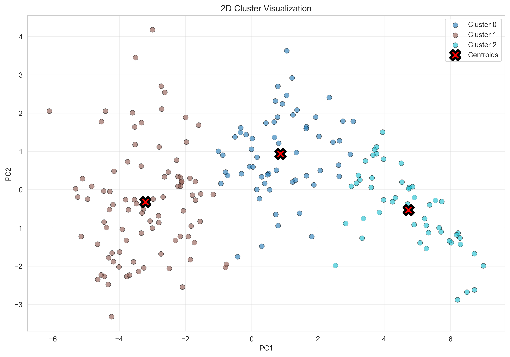
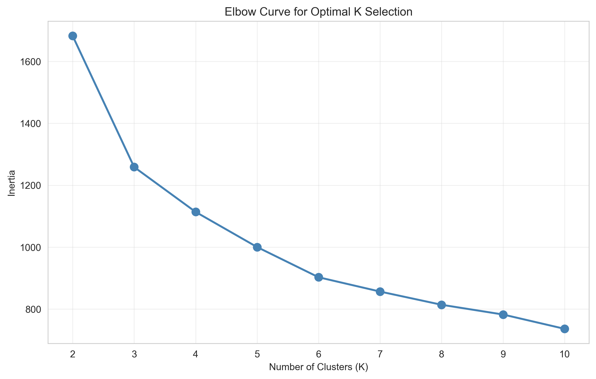
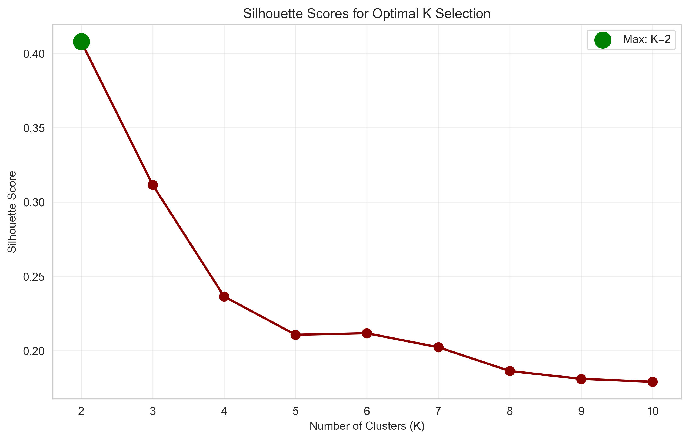
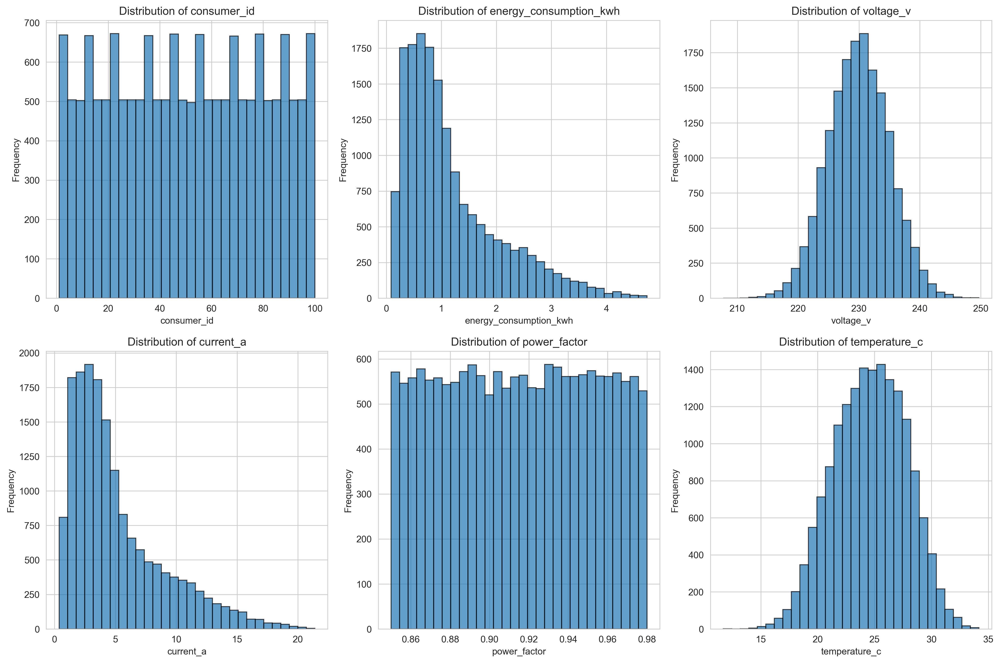
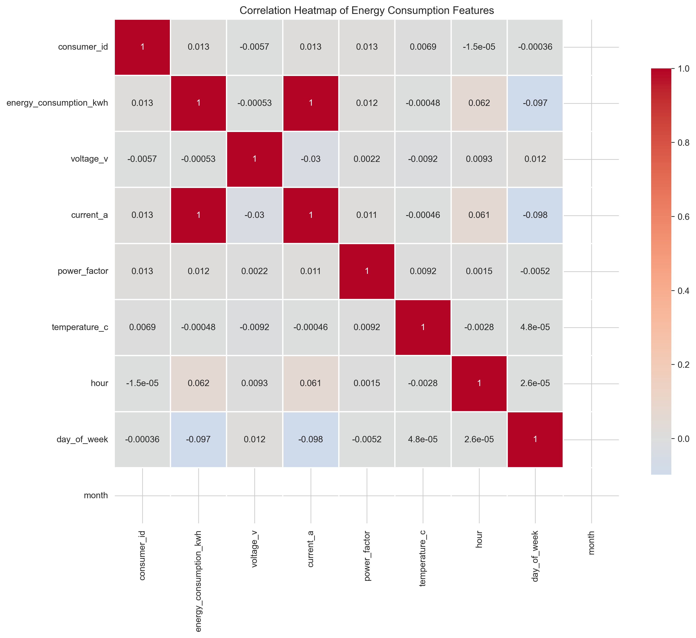
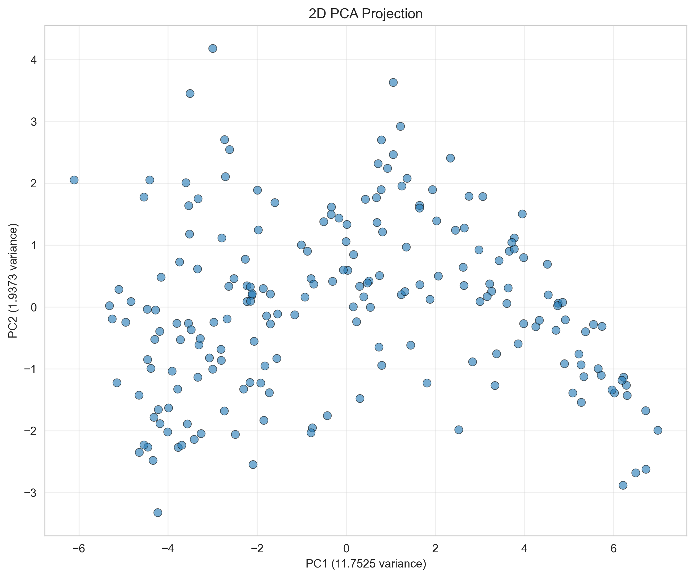
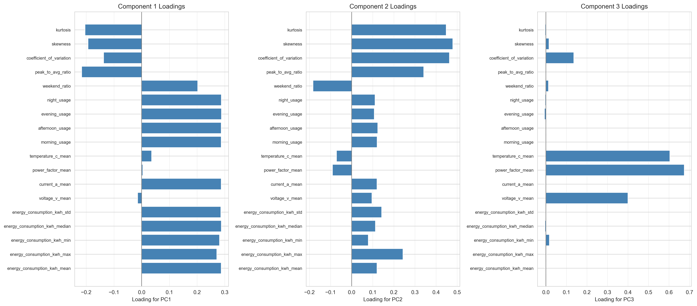
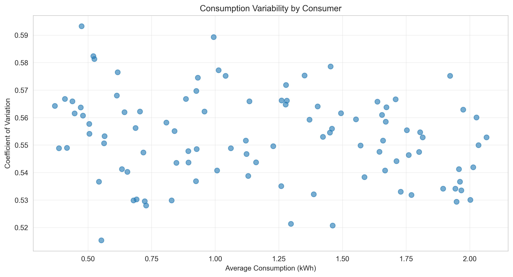
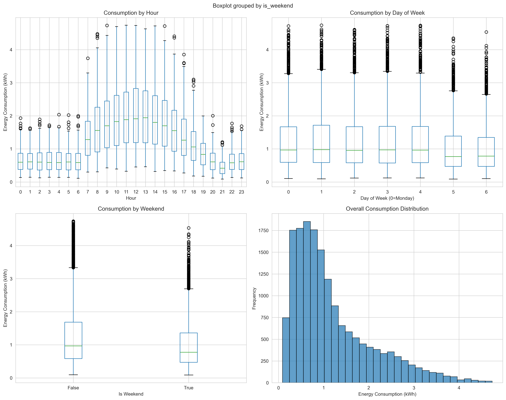

# Energy Consumption Pattern Analysis

**Discovering daily energy rhythms using machine learning**

[](https://energy-consumption-pattern.vercel.app)
[](https://energy-consumption-pattern-vqrh.streamlit.app/)

## What This Project Does

Ever wondered if there are patterns in how people use electricity throughout the day? This project finds those patterns automatically using machine learning.

**Here's what we do:**
We look at 200 households and track their electricity usage every hour for 30 days. Then, we use smart algorithms to group them into patterns based on when they use energy during the day, not just how much they use overall.

**What we discovered:**
The analysis found three clear groups. Some households peak at midday, others spike in the evening, and some maintain steady usage all day long.

**Why it matters:**
Understanding these patterns helps electric companies serve customers better without invading anyone's privacy. It can improve how the power grid operates, make pricing fairer, and help design better energy-saving programs.

## Try It Live

**Interactive Web Dashboard** - [Explore the analysis results](https://energy-consumption-pattern.vercel.app) with beautiful charts and visualizations

**Streamlit Simulator** - [Adjust the settings yourself](https://energy-consumption-pattern-vqrh.streamlit.app/) and watch how the patterns change in real-time

## Visual Results

### Daily Load Patterns by Cluster

Three distinct energy usage patterns emerged from the data:


**What you're seeing:** Each line shows the average hourly electricity usage for one cluster. Notice how different groups peak at different times of day.

### Cluster Comparison


**What you're seeing:** How energy patterns change between weekdays and weekends for each cluster.

### The Three Patterns We Found

| Pattern | Size | Peak Time | Description |
|---------|------|-----------|-------------|
| **Midday-Peaking** | 94 households (47%) | 1 PM | Usage rises through morning, plateaus in afternoon |
| **Flat All-Day** | 57 households (28%) | 7 PM | Steady throughout day with weak evening peak |
| **Evening-Peaking** | 49 households (25%) | 8 PM | Quiet by day, sharp spike after dark |

### How We Group Similar Patterns



**What you're seeing:** Each dot is a household. Colors show which group they belong to. Close dots have similar energy patterns.

### Choosing the Right Number of Groups



**What you're seeing:** This chart helps us pick 3 groups as the sweet spot - not too many, not too few.



**What you're seeing:** Higher scores mean better separation between groups. K=3 gives us clear, distinct patterns.

### Understanding the Data Better



**What you're seeing:** How different energy usage measurements are spread across all households.



**What you're seeing:** Which energy measurements tend to move together (darker colors = stronger relationship).

### Dimensionality Reduction (PCA)


**What you're seeing:** We compress 51 features down to 14 components while keeping 95% of the important information.



**What you're seeing:** The entire dataset squeezed into 2 dimensions, showing natural groupings.



**What you're seeing:** Which original features matter most for each compressed component.

### Variability Analysis



**What you're seeing:** How much energy usage fluctuates throughout the day for each cluster.



**What you're seeing:** Statistical distribution of energy usage at different times of day.

## How It Works

### A Simple Explanation

Think of it like sorting photos: you have thousands of pictures and want to organize them into albums. But instead of sorting photos, we're sorting households by their daily energy habits.

Here's the step-by-step process:

1. **Gather the data** - We track how much electricity each home uses, hour by hour, for a full month
2. **Look for meaningful patterns** - We calculate things like "what percentage of their daily energy do they use in the morning versus evening?"
3. **Simplify the numbers** - Instead of tracking 51 different measurements, we use a technique called PCA to boil it down to just 14 key numbers that capture the important differences
4. **Group similar households** - An algorithm called K-Means automatically finds which homes have similar energy habits
5. **Make sense of the results** - We look at each group and describe what makes them unique

### For the Tech-Savvy

**Data:**
- 200 synthetic consumers (generated with realistic patterns)
- 30 days of hourly readings
- 144,000 total data points

**Features Engineered:**
- 24 hourly consumption values
- 4 time-of-day shares (morning, afternoon, evening, night)
- Statistical measures (peak hour, base load, variation coefficient)

**Machine Learning Steps:**
1. **Standardization** - Make all measurements comparable by scaling them (imagine converting all currencies to dollars before comparing prices)
2. **PCA (Principal Component Analysis)** - Compress 51 features into 14 components while keeping 95.3% of the important information
3. **K-Means Clustering** - Sort households into 3 groups based on similarity
4. **Validation** - Use multiple scoring methods to confirm the groups make sense

**Quality Checks:**
- Silhouette Score: 0.34 (shows decent separation between groups)
- Davies-Bouldin Index: Measures how distinct the groups are (lower is better)
- Calinski-Harabasz Score: Measures cluster density (higher is better)
- Gap Statistic: Confirms that 3 groups is the right number

## Run It Yourself

### Quick Start

```bash
# Clone the repository
git clone https://github.com/shaxntanu/Energy-Consumption-Pattern-Analysis-using-PCA-and-K-Means.git
cd Energy-Consumption-Pattern-Analysis-using-PCA-and-K-Means

# Install dependencies
pip install -r requirements.txt

# Run the Streamlit simulator
streamlit run streamlit_app.py
```

### Web Dashboard (Local)

```bash
cd web
npm install
npm run dev
```

Open http://localhost:5173

## Project Structure

```
├── baseline/
│   ├── figures/figures/     # All the matplotlib visualizations
│   ├── models/models/       # Trained PCA and K-Means models
│   └── metrics/metrics/     # Evaluation results (CSV)
├── web/
│   └── src/                 # React web dashboard source
├── src/                     # Python analysis modules
├── streamlit_app.py         # Interactive simulator
└── README.md                # You are here
```

## Technologies Used

- **Python**: NumPy, Pandas, Scikit-learn, Matplotlib, Plotly
- **Web**: React, Vite, Chart.js
- **Deployment**: Vercel (web), Streamlit Cloud (simulator)

## Key Takeaways

1. **Timing matters more than totals** - It's not just about how much electricity you use, but when you use it during the day
2. **Clear patterns emerge naturally** - Without being told what to look for, the algorithm found three distinct groups: midday users, evening users, and steady-all-day users
3. **You can compress data without losing meaning** - We reduced 51 measurements down to 14 while keeping 95% of the useful information intact
4. **The patterns are reliable** - Even when we run the analysis multiple times with different starting points, we get the same three groups

## What You Can Learn From This Project

- How to apply PCA for dimensionality reduction
- K-Means clustering for pattern discovery
- Feature engineering for time-series data
- Model evaluation and validation
- Building interactive data dashboards
- Deploying ML visualizations

## Academic Background

This analysis is inspired by real-world energy studies but uses synthetic data for transparency and reproducibility. The methodology follows established practices in load profiling research:

- Feature engineering based on domain knowledge
- Pre-registered analysis plan (no p-hacking)
- Multiple validation metrics
- Clear documentation of limitations

## Important Limitations

- **Practice data, not real people** - We generated this data with realistic patterns built in, so we already knew roughly what to expect. Real household data would be messier and more interesting
- **Just one month** - We only looked at 30 days of usage. Real patterns change with seasons - air conditioning in summer, heating in winter
- **Missing context** - We didn't include weather, electricity prices, or any information about the households themselves. All of these affect real energy use
- **Describes the past, doesn't predict the future** - This analysis shows you what patterns exist in the data, but it doesn't forecast what will happen tomorrow
