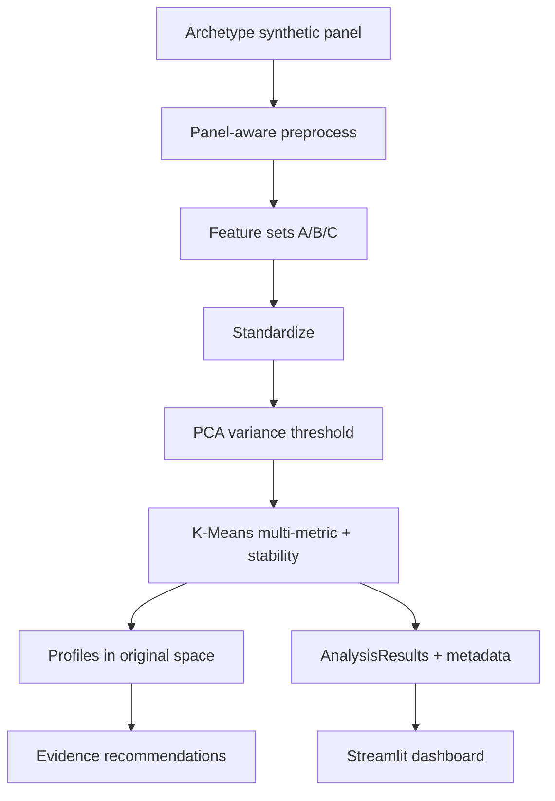

# Baseline vs Corrected Comparison

Numbers below are from **executed** pipeline outputs. Baseline = `baseline/` (Phase 0 archive). Corrected = `outputs/` + `models/` after remediation (behavioral primary experiment).

## Side-by-side

| Metric | Baseline | Corrected (behavioral) |
|--------|----------|------------------------|
| Data source | Synthetic (single shared shape) | Synthetic (**archetype-based**, labeled) |
| Consumers × days | 200 × 30 | 200 × 30 |
| Feature count (modeling) | 18 mixed scale/electrical/behavior | ~32–34 behavioral (normalized shape + timing + variability) |
| `weekend_ratio` definition | `mean(is_weekend)` ≈ **0.267 all clusters** | `weekend_mean / weekday_mean` (varies by cluster) |
| PCA components | 6 (≥95% cum. var.) | Documented ≥95% threshold (see `outputs/metrics/pca_results.csv`) |
| PCA PC1 share | ~65.3% (scale-dominated) | Lower concentration across PCs (see metrics CSV) |
| K range | 2–10 | 2–10 |
| Best silhouette K | **2** (0.408) | **2** (0.1055) |
| Selected K | **3** (hard preference 3–6) | **2** (multi-metric consensus) |
| Final silhouette | 0.312 (at K=3) | **0.1055** (at K=2) — honestly weaker; shape is harder |
| Calinski-Harabasz | 170.95 | 16.60 (behavioral @ K=2) |
| Davies-Bouldin | 1.11 | 3.29 (behavioral @ K=2) |
| Cluster sizes | 60 / 90 / 50 | 135 / 65 |
| Cluster meaning | Low / mid / high **magnitude** | Timing/variability-oriented names (see profiles) |
| Stability (ARI) | Not reported | Mean ARI **0.791** (±0.111) over 10 seeds |
| Recommendations | Generic repeats | Evidence-triggered per cluster |
| Dependencies | Unpinned `>=` | Exact pins in `requirements.txt` |

## Ablation context (corrected codebase)

From `outputs/reports/ablation_study_report.md`:

| Feature set | Optimal K | Silhouette | Stability ARI | Interpretation |
|-------------|-----------|------------|---------------|----------------|
| scale | 2 | ~0.32 | ~1.00 | Strong separation — largely **magnitude** |
| behavioral | 2 | ~0.10 | ~0.78 | Weaker metrics; targets **pattern** objective |
| combined | 2 | ~0.10 | ~0.97 | Mixed |

**Conclusion for viva:** Scale “looks better” on silhouette because magnitude separates cleanly. The project title and scientific goal require the **behavioral** experiment. Reporting weaker silhouette on behavioral features is preferred over manufacturing a magnitude story.

## Architecture (corrected)

## Honesty note

Corrected behavioral clustering does **not** claim strong separation. Silhouette ~0.10 is moderate-to-weak. That is an expected trade-off when removing the scale crutch. Limitations are documented in the dashboard Limitations page and `docs/FINAL_REPORT.md`.
