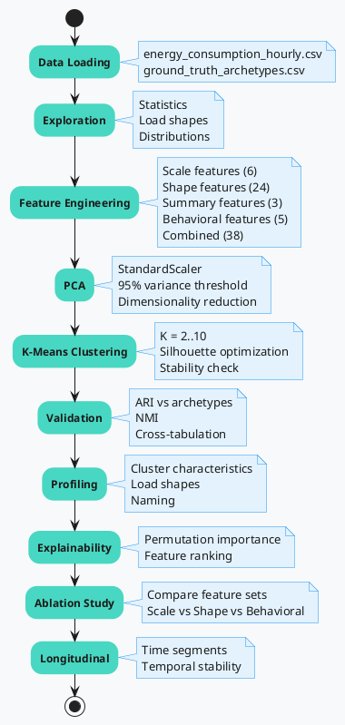

# Energy Consumption Pattern Analysis - Kaggle Notebook

This directory contains a Kaggle-compatible notebook for analyzing household energy consumption patterns using PCA and K-Means clustering.

## Overview

## Contents

- **`energy_consumption_clustering.ipynb`**: Complete analysis notebook covering:
  - Data loading and exploration
  - Feature engineering (scale, shape, summary, behavioral features)
  - Principal Component Analysis (PCA)
  - K-Means clustering with K-selection
  - Cluster validation using Adjusted Rand Index (ARI)
  - Cluster profiling and interpretation
  - Explainability using permutation importance
  - Ablation study comparing feature sets
  - Longitudinal analysis for temporal stability

- **`dataset/`**: Synthetic dataset directory
  - `energy_consumption_hourly.csv`: Hourly energy consumption data
  - `ground_truth_archetypes.csv`: Ground truth labels for validation
  - `README.md`: Detailed dataset documentation
  - `dataset_metadata.json`: Dataset metadata
  - `LICENSE`: Dataset license

## Usage on Kaggle

1. Create a new Kaggle dataset using the files in `dataset/`
2. Upload the notebook to Kaggle
3. Link the dataset to the notebook
4. Run the notebook end-to-end

## Key Features

- **Self-contained**: All feature engineering and analysis logic is included in the notebook
- **Visualizations**: Multiple plots for data exploration, clustering results, and validation
- **Validation**: Uses ground truth archetypes to measure clustering quality
- **Explainability**: Identifies which features drive cluster assignments
- **Robustness Analysis**: Includes ablation study and longitudinal stability checks

## Requirements

The notebook requires the following Python packages:
- numpy
- pandas
- matplotlib
- seaborn
- scikit-learn

These are typically available in Kaggle's default environment.

## Dataset Details

The synthetic dataset contains:
- 200 consumers
- 30 days of hourly energy consumption records
- 5 hidden archetypes for validation

See `dataset/README.md` for more details.

## Note

This notebook is a simplified version of the full pipeline in the `src/` directory. For production use or more advanced analyses (seed robustness, detailed reports), refer to the main project scripts.
